# Vanmniljø Arctic/Marine Exploration

Based on the scoping and exploration work we’ve done elsewhere we can
start to focus on our main area of interest: mixtures of pollutants
above the Arctic circle, in saltwater and saltwater sediment. We’ll use
the datasets that are filtered to `Saltvann` and `Saltvann sediment`
simply because that’s the easiest way to get a relevant subset of the
data from Vannmiljø.

Code

``` r

library(arrow)
library(here)
library(dplyr)
library(sf)
library(ggplot2)
library(readxl)
library(ggrepel)
```

Code

``` r

WaterRegistrationExport_NO_Jan10_Jan25_SV <- read_parquet(
  here(
    "inst",
    "example_datasets",
    "registrations",
    "WaterRegistrationExport-NO-Jan10-Jan25-SV.parquet"
  )
)

WaterRegistrationExport_NO_Jan10_Jan25_SedSV <- read_parquet(
  here(
    "inst/example_datasets/registrations/WaterRegistrationExport-NO-Jan10-Jan25-SedSV.parquet"
  )
)

pollutants <- read_excel(
  here("data/raw/vannmiljo/Vannmiljø_Miljøgifter_2026-09-29.xlsx")
)

all_data <- add_row(
  WaterRegistrationExport_NO_Jan10_Jan25_SV,
  WaterRegistrationExport_NO_Jan10_Jan25_SedSV
)

nrow(all_data)
```

    [1] 565675

Now filter to above the Arctic circle:

Code

``` r

arctic_circle_lat <- 66.5636 # approximate latitude of the Arctic Circle

reproject_4326 <- function(dataset) {
  dataset |>
    filter(
      !is.na(`UTM33 Ost (X)`) &
        !is.na(`UTM33 Nord (Y)`)
    ) |>
    st_as_sf(
      coords = c("UTM33 Ost (X)", "UTM33 Nord (Y)"),
      crs = 25833,
      remove = FALSE
    ) |>
    st_transform(4326) |>
    mutate(LATITUDE = st_coordinates(geometry)[, 2])
}

all_data_reproj <- all_data |>
  reproject_4326() |>
  mutate(arctic = LATITUDE >= arctic_circle_lat)
# drop rows without spatial data

all_data_reproj_arctic <- all_data_reproj |> filter(arctic)

nrow(all_data_reproj_arctic)
```

    [1] 124624

Roughly 20% of the data is reportedly Arctic. Let’s visualise and check:

Code

``` r

all_data_reproj_sf <- all_data_reproj |>
  group_by(Vannlokalitet_kode) |>
  reframe(
    Type,
    Medium_navn,
    Aktivitet_navn,
    Parameter_navn,
    arctic,
    geometry
  ) |>
  st_as_sf()

norway_bbox <- sf::st_bbox(
  c(xmin = 4, ymin = 57.5, xmax = 35.5, ymax = 81),
  crs = sf::st_crs(4326)
)

europe_context <- rnaturalearth::ne_countries(
  scale = "large",
  continent = "Europe",
  returnclass = "sf"
) |>
  st_crop(
    c(xmin = 4, ymin = 57.5, xmax = 45, ymax = 81) |>
      st_bbox() |>
      st_set_crs(4326)
  )

ggplot(europe_context) +
  geom_sf() +
  geom_hline(
    yintercept = arctic_circle_lat,
    linetype = "dashed",
    colour = "grey40"
  ) +
  geom_sf(data = all_data_reproj_sf, aes(colour = arctic))
```

[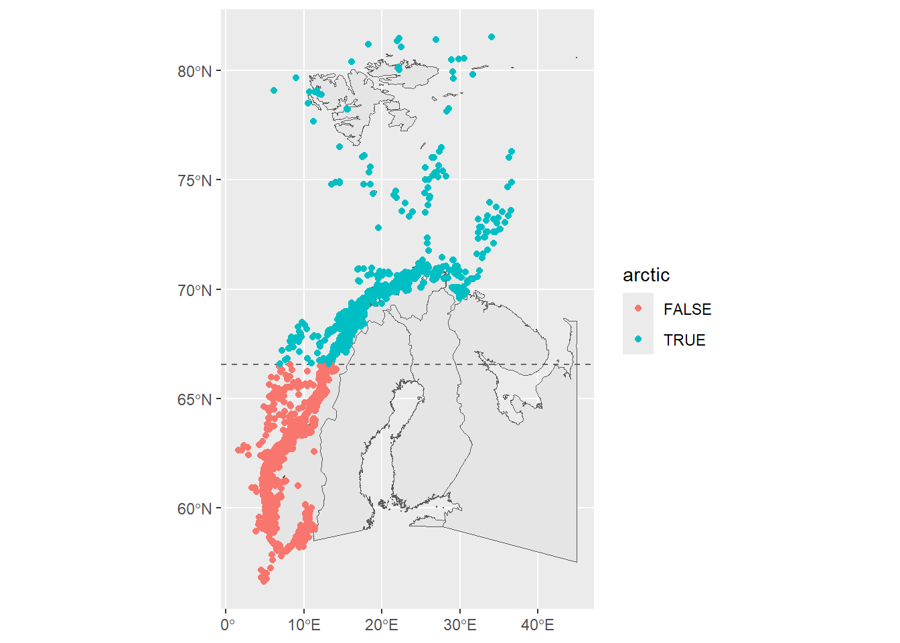](https://sawelch-niva.github.io/Vm2eData/articles/vannmiljo-expect-data_files/figure-html/unnamed-chunk-4-1.png)

That looks right. Let’s look at the hotspots where stressors are
measured the most:

Code

``` r

bigger_arctic_bbox <- sf::st_bbox(
  c(xmin = 4, ymin = 65, xmax = 40, ymax = 75),
  crs = sf::st_crs(4326)
)

arctic_context <- europe_context

# Hexes are binned in x/y units, so project to metres first (ETRS89 / UTM 33N)
map_crs <- 25833
plot_bbox <- bigger_arctic_bbox |>
  st_as_sfc() |>
  st_transform(map_crs) |>
  st_bbox()

# Trim the empty east: a lon/lat box widens once projected, so set xmax from
# the projected extent of the arctic data (plus a 50 km margin) instead.
plot_bbox[["xmax"]] <- all_data_reproj_sf |>
  filter(arctic) |>
  st_transform(map_crs) |>
  st_coordinates() |>
  _[, 1] |>
  max() +
  50000

# A parallel is a curve in UTM 33N, so build it as a densified line in lon/lat
# and project it, rather than using a straight horizontal line.
arctic_circle_line <- st_linestring(
  cbind(seq(0, 45, by = 0.25), arctic_circle_lat)
) |>
  st_sfc(crs = 4326) |>
  st_transform(map_crs)

# Only label the larger cities that are on the map and near/north of the Arctic
# Circle; the rest are mostly noise relative to the hexes.
norway_cities <- read_excel(here("inst", "worldcities.xlsx")) |>
  filter(iso2 == "NO") |>
  st_as_sf(coords = c("lng", "lat"), crs = st_crs(4326)) |>
  st_crop(bigger_arctic_bbox) |>
  filter(st_coordinates(geometry)[, 2] >= arctic_circle_lat - 1) |>
  st_transform(map_crs)

all_data_reproj_sf_xy <- all_data_reproj_sf |>
  st_crop(bigger_arctic_bbox) |>
  st_transform(map_crs) |>
  mutate(
    x = st_coordinates(geometry)[, 1],
    y = st_coordinates(geometry)[, 2]
  )

# Where the projected Arctic Circle meets the right-hand edge, for its label
arctic_label_y <- st_coordinates(arctic_circle_line) |>
  as.data.frame() |>
  slice_min(abs(X - plot_bbox[["xmax"]]), n = 1) |>
  pull(Y)

cell_size <- 20000 # metres (UTM 33N)

plot_grid_density <- function(data, medium_navn, option, title) {
  ggplot() +
    geom_sf(
      data = arctic_context,
      fill = NA,
      colour = "grey30",
      linewidth = 0.2
    ) +
    geom_bin_2d(
      data = if (is.null(medium_navn)) {
        data
      } else {
        filter(data, Medium_navn == medium_navn)
      },
      aes(x = x, y = y),
      binwidth = c(cell_size, cell_size),
      boundary = 0, # same grid origin on every map, so maps are comparable
      alpha = 0.75
    ) +
    geom_sf(
      data = arctic_circle_line,
      colour = "firebrick",
      linetype = "dashed",
      linewidth = 0.6
    ) +
    annotate(
      "text",
      x = plot_bbox[["xmax"]],
      y = arctic_label_y,
      label = "Arctic Circle",
      colour = "firebrick",
      hjust = 1,
      vjust = -0.5,
      size = 3.2
    ) +
    geom_sf(
      data = norway_cities,
      shape = 21,
      fill = NULL,
      colour = "red",
      size = 1.8
    ) +
    geom_text_repel(
      data = norway_cities,
      aes(label = city, geometry = geometry),
      stat = "sf_coordinates",
      size = 3,
      colour = "black",
      bg.colour = "white", # white halo keeps labels legible over the cells
      bg.r = 0.15,
      min.segment.length = 0.2,
      segment.colour = "grey40",
      max.overlaps = Inf
    ) +
    coord_sf(
      crs = map_crs,
      xlim = plot_bbox[c("xmin", "xmax")],
      ylim = plot_bbox[c("ymin", "ymax")],
      expand = FALSE
    ) +
    scale_fill_viridis_c(
      name = "Measurements",
      option = option
    ) +
    theme_minimal() +
    theme(axis.title = element_blank()) +
    labs(title = title, subtitle = paste0(cell_size / 1000, " km grid"))
}
```

Code

``` r

plot_grid_density(
  all_data_reproj_sf_xy,
  "Saltvann",
  "viridis",
  "Monitoring density, arctic sites: saltvann"
)
```

[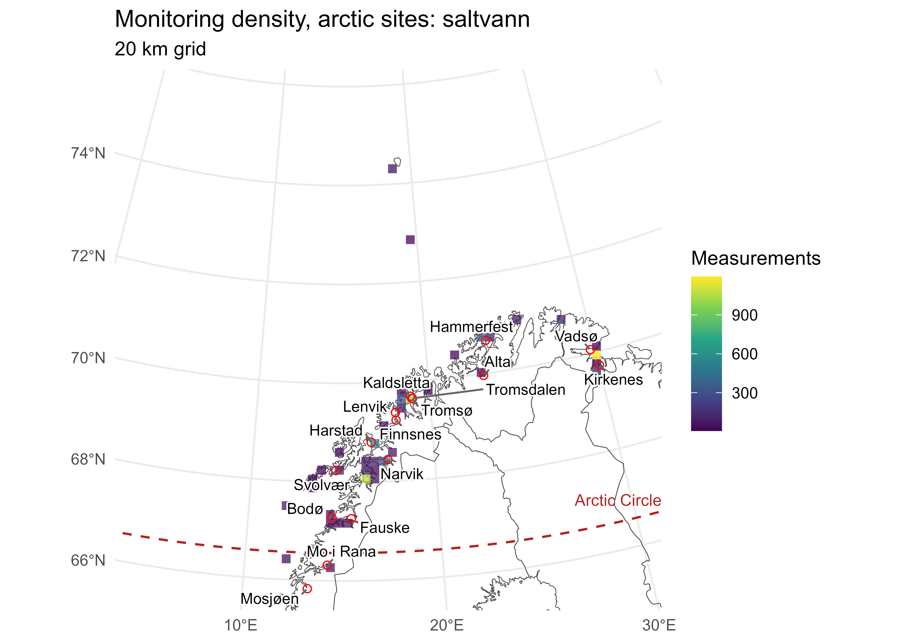](https://sawelch-niva.github.io/Vm2eData/articles/vannmiljo-expect-data_files/figure-html/unnamed-chunk-6-1.png)

What do we learn? Well, first of all, we don’t have a lot of choices
when it comes to saltwater monitoring sites. Vadsø is by far the most
monitored site, followed by:

- Hammerfest
- Harstad
- Tromsø/Kaldsletta
- Tysfjorden, SW of Narvik

Code

``` r

plot_grid_density(
  all_data_reproj_sf_xy,
  "Sediment saltvann",
  "plasma",
  "Monitoring density, arctic sites: sediment saltvann"
)
```

[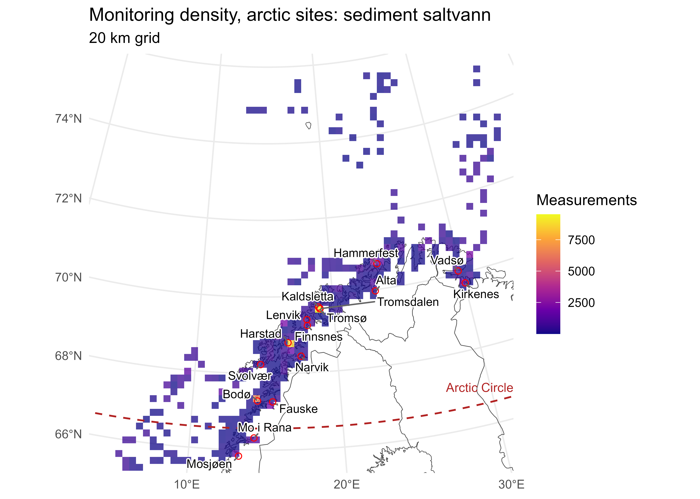](https://sawelch-niva.github.io/Vm2eData/articles/vannmiljo-expect-data_files/figure-html/unnamed-chunk-7-1.png)

## Without aquaculture?

Code

``` r

plot_grid_density(
  all_data_reproj_sf_xy |>
    filter(Aktivitet_navn != "Miljøovervåking akvakulturanlegg"),
  "Sediment saltvann",
  "plasma",
  "Monitoring density, arctic sites: sediment saltvann"
)
```

[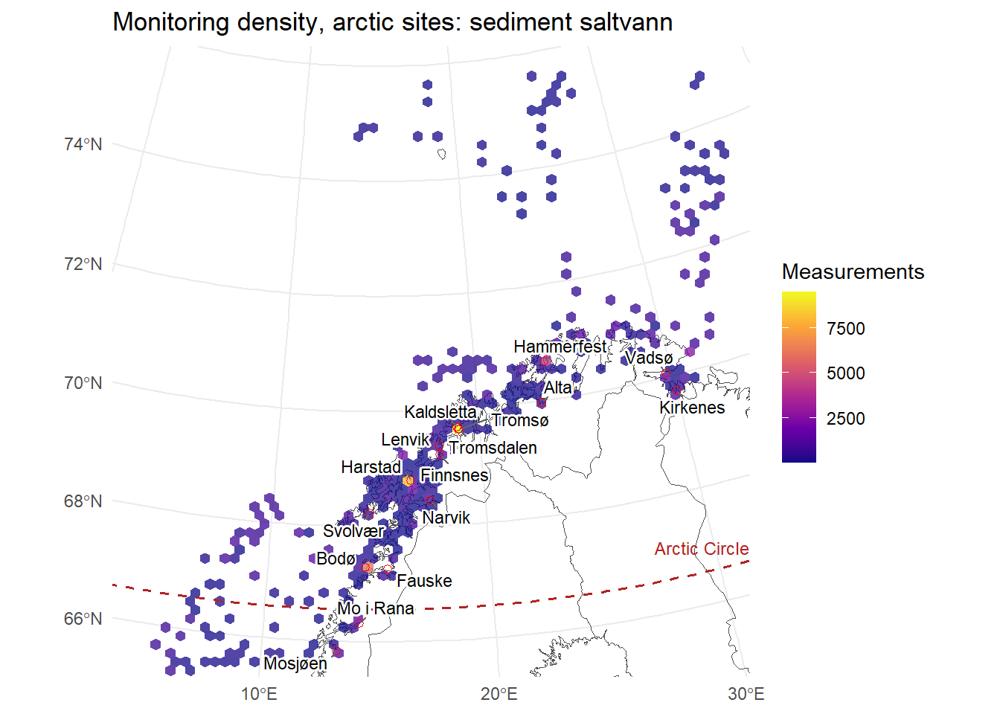](https://sawelch-niva.github.io/Vm2eData/articles/vannmiljo-expect-data_files/figure-html/unnamed-chunk-8-1.png)

Sediment monitoring is much more thorough across the entire coast of
Norway, and at points in the sea. The most monitored sites are:

- Tromsø/Kaldsletta
- Harstad
- Bodø
- Hammerfest

This raises some immediate questions:

1.  Why is Vadsø important for sea water but not sediment?
2.  Likewise Tysfjorden

What are the main campaigns contributing here again?

Code

``` r

# this is still sediment and seawater only

all_data_reproj |>
  filter(arctic) |>
  st_drop_geometry() |>
  reframe(
    .by = "Aktivitet_navn",
    n = n(),
    n_stressors = n_distinct(Parameter_casnr)
  ) |>
  arrange(desc(n))
```

It’s at this point I go into a detailed look at the spatial distribution
and chemical inventory of each activity:

## Density by activity

One section per activity, ordered by number of measurements (n, from the
table above).

Each activity also gets a plot of how many distinct substances were
monitored per year, one line per `SubGroupID`:

Code

``` r

plot_substances_per_year <- function(activity) {
  all_data_reproj_arctic |>
    st_drop_geometry() |>
    filter(Aktivitet_navn == activity) |>
    mutate(year = as.integer(substr(Tid_provetak, 1, 4))) |>
    left_join(pollutants, by = join_by(Parameter_navn == Name)) |>
    mutate(SubGroupID = coalesce(SubGroupID, "Unclassified")) |>
    reframe(
      .by = c(year, SubGroupID),
      n_substances = n_distinct(Parameter_navn)
    ) |>
    ggplot(aes(x = year, y = n_substances, colour = SubGroupID)) +
    geom_line() +
    geom_point() +
    labs(x = "Year", y = "Unique substances monitored", colour = "SubGroupID")
}
```

### Overvåking av forurenset sjøbunn

n = 49602.

- Biggest driver. Lots of metals, some PAHs, PCBs, tinorganic substances
- Harstad, Tromsø, Bodø
- Sediment only, except for a subset which I suspect are miscoded?

Code

``` r

plot_grid_density(
  all_data_reproj_sf_xy |>
    filter(Aktivitet_navn == "Overvåking av forurenset sjøbunn"),
  "Sediment saltvann",
  "viridis",
  "Overvåking av forurenset sjøbunn"
)
```

[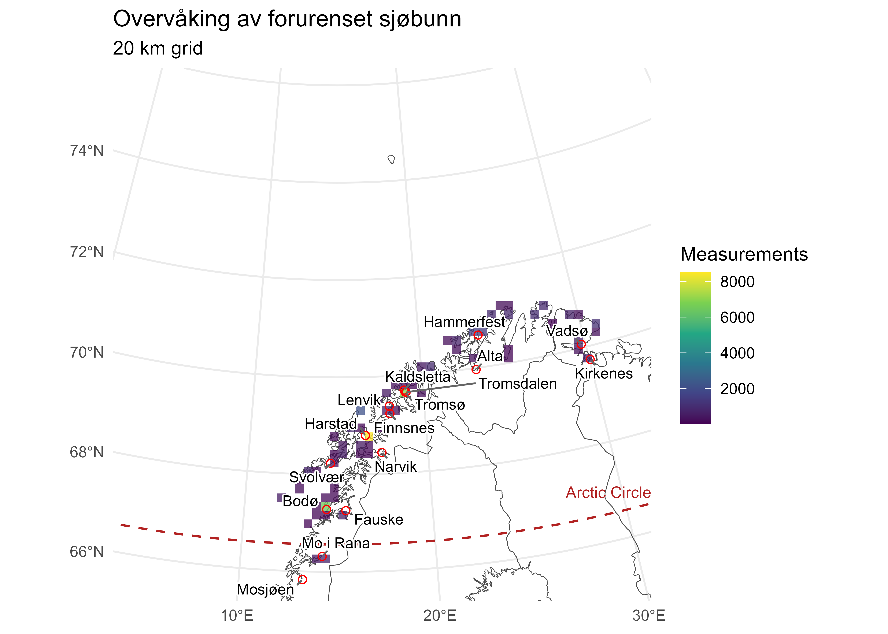](https://sawelch-niva.github.io/Vm2eData/articles/vannmiljo-expect-data_files/figure-html/map-overvaking-av-forurenset-sjobunn-1.png)

Code

``` r

all_data_reproj_sf_xy |>
  filter(arctic, Aktivitet_navn == "Overvåking av forurenset sjøbunn") |>
  group_by(Medium_navn, Parameter_navn) |>
  reframe(n = n()) |>
  filter(n > 10) |>
  left_join(pollutants, by = join_by(Parameter_navn == Name)) |>
  ggplot(mapping = aes(y = Parameter_navn, x = Medium_navn, fill = n)) +
  geom_tile() +
  scale_fill_viridis_c() +
  facet_grid(rows = vars(SubGroupID), scales = "free", space = "free")
```

[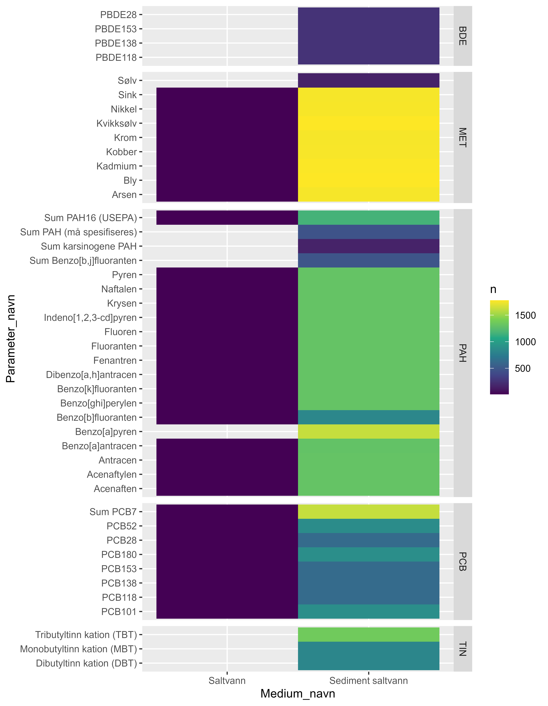](https://sawelch-niva.github.io/Vm2eData/articles/vannmiljo-expect-data_files/figure-html/heatmap-overvaking-av-forurenset-sjobunn-1.png)

#### Substances monitored per year

Code

``` r

plot_substances_per_year("Overvåking av forurenset sjøbunn")
```

[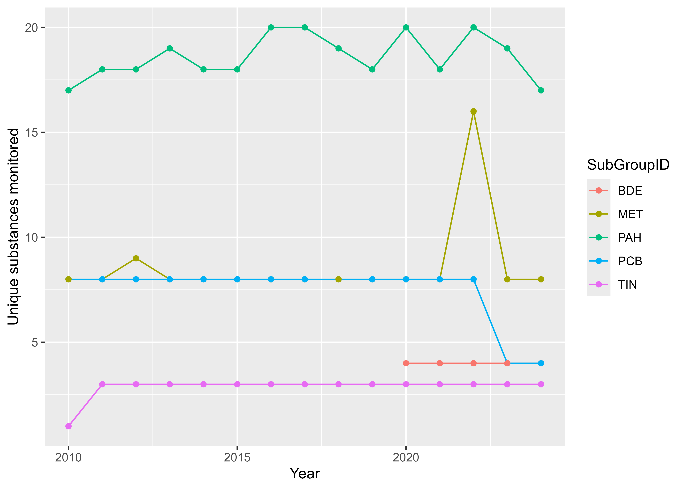](https://sawelch-niva.github.io/Vm2eData/articles/vannmiljo-expect-data_files/figure-html/substances-per-year-overvaking-av-forurenset-sjobunn-1.png)

### Kartlegging av miljøgifter i sedimenter - MAREANO

n = 40808.

- Next biggest dataset.
- Largely open ocean, with the exception of some points around Narvik
  (but not densely monitored)
- Haven’t checked the open ocean hotspots against wrecks/dumping sites,
  or offshore facilities
- Almost only PAHs

Code

``` r

plot_grid_density(
  all_data_reproj_sf_xy |>
    filter(
      Aktivitet_navn == "Kartlegging av miljøgifter i sedimenter - MAREANO"
    ),
  "Sediment saltvann",
  "viridis",
  "Kartlegging av miljøgifter i sedimenter - MAREANO"
)
```

[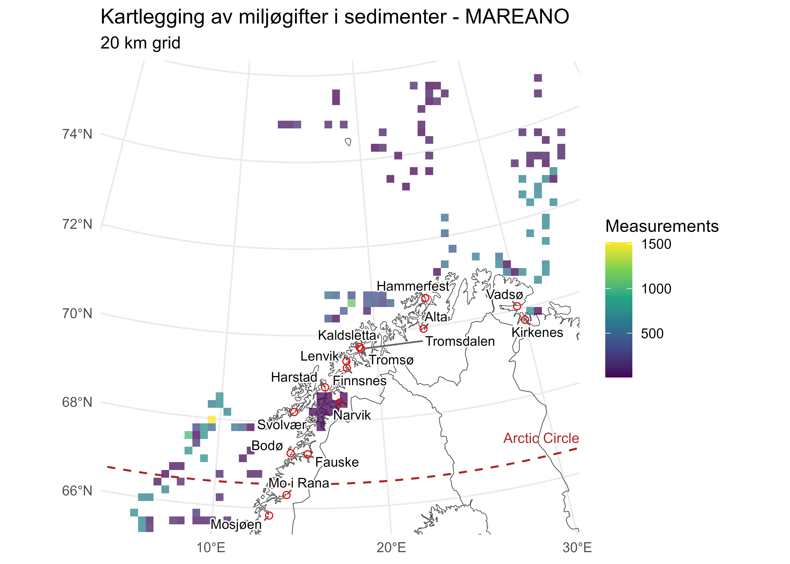](https://sawelch-niva.github.io/Vm2eData/articles/vannmiljo-expect-data_files/figure-html/map-kartlegging-av-miljogifter-i-sedimenter-mareano-1.png)

Code

``` r

all_data_reproj_sf_xy |>
  filter(
    arctic,
    Aktivitet_navn == "Kartlegging av miljøgifter i sedimenter - MAREANO"
  ) |>
  group_by(Medium_navn, Parameter_navn) |>
  reframe(n = n()) |>
  filter(n > 10) |>
  left_join(pollutants, by = join_by(Parameter_navn == Name)) |>
  ggplot(mapping = aes(y = Parameter_navn, x = Medium_navn, fill = n)) +
  geom_tile() +
  scale_fill_viridis_c() +
  facet_grid(rows = vars(SubGroupID), scales = "free", space = "free")
```

[](https://sawelch-niva.github.io/Vm2eData/articles/vannmiljo-expect-data_files/figure-html/heatmap-kartlegging-av-miljogifter-i-sedimenter-mareano-1.png)

#### Substances monitored per year

Code

``` r

plot_substances_per_year("Kartlegging av miljøgifter i sedimenter - MAREANO")
```

[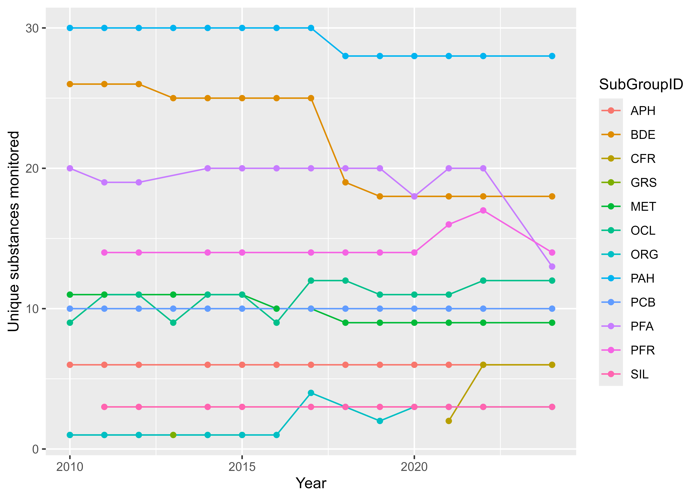](https://sawelch-niva.github.io/Vm2eData/articles/vannmiljo-expect-data_files/figure-html/substances-per-year-kartlegging-av-miljogifter-i-sedimenter-mareano-1.png)

### Miljøovervåking akvakulturanlegg

- Almost only copper and zinc
- Hotspots around Fauske, Alta, Finnsnes
- Probably not a useful source of data? Depends how spatially specific
  we want to be, but I assume that copper/zinc pollution from fish farms
  is localised and sediment-associated

Code

``` r

all_data_reproj_sf_xy |>
  filter(arctic, Aktivitet_navn == "Miljøovervåking akvakulturanlegg") |>
  group_by(Medium_navn, Parameter_navn) |>
  reframe(n = n()) |>
  filter(n > 10) |>
  left_join(pollutants, by = join_by(Parameter_navn == Name)) |>
  ggplot(mapping = aes(y = Parameter_navn, x = Medium_navn, fill = n)) +
  geom_tile() +
  scale_fill_viridis_c() +
  facet_grid(rows = vars(SubGroupID), scales = "free", space = "free")
```

[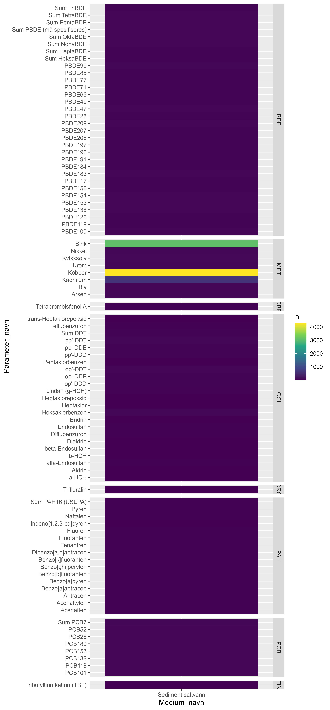](https://sawelch-niva.github.io/Vm2eData/articles/vannmiljo-expect-data_files/figure-html/heatmap-miljoovervaking-akvakulturanlegg-1.png)

n = 12273.

Code

``` r

plot_grid_density(
  all_data_reproj_sf_xy |>
    filter(Aktivitet_navn == "Miljøovervåking akvakulturanlegg"),
  "Sediment saltvann",
  "viridis",
  "Miljøovervåking akvakulturanlegg"
)
```

[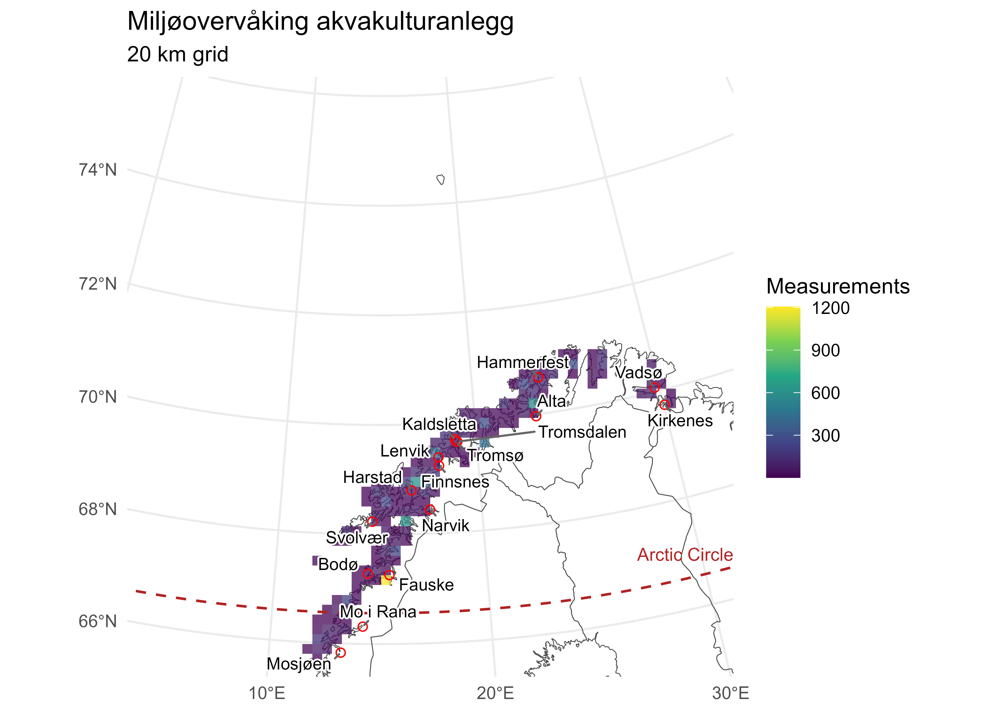](https://sawelch-niva.github.io/Vm2eData/articles/vannmiljo-expect-data_files/figure-html/map-miljoovervaking-akvakulturanlegg-1.png)

#### Substances monitored per year

Code

``` r

plot_substances_per_year("Miljøovervåking akvakulturanlegg")
```

[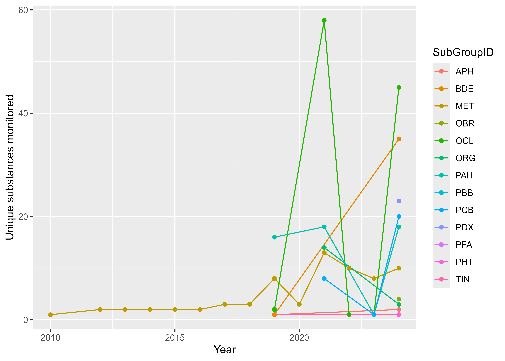](https://sawelch-niva.github.io/Vm2eData/articles/vannmiljo-expect-data_files/figure-html/substances-per-year-miljoovervaking-akvakulturanlegg-1.png)

### Overvåking av påvirkning fra industri

- Probably our best best for identfying historically contaminated fjords
  which aren’t also major settlements
- Hotpots: Hammerfest, Mosjøen, Finnsnes/Lenvikk, the square to the SW
  of Narvik
- Metals, PAHs

n = 5899.

Code

``` r

plot_grid_density(
  all_data_reproj_sf_xy |>
    filter(Aktivitet_navn == "Overvåking av påvirkning fra industri"),
  "Sediment saltvann",
  "viridis",
  "Overvåking av påvirkning fra industri"
)
```

[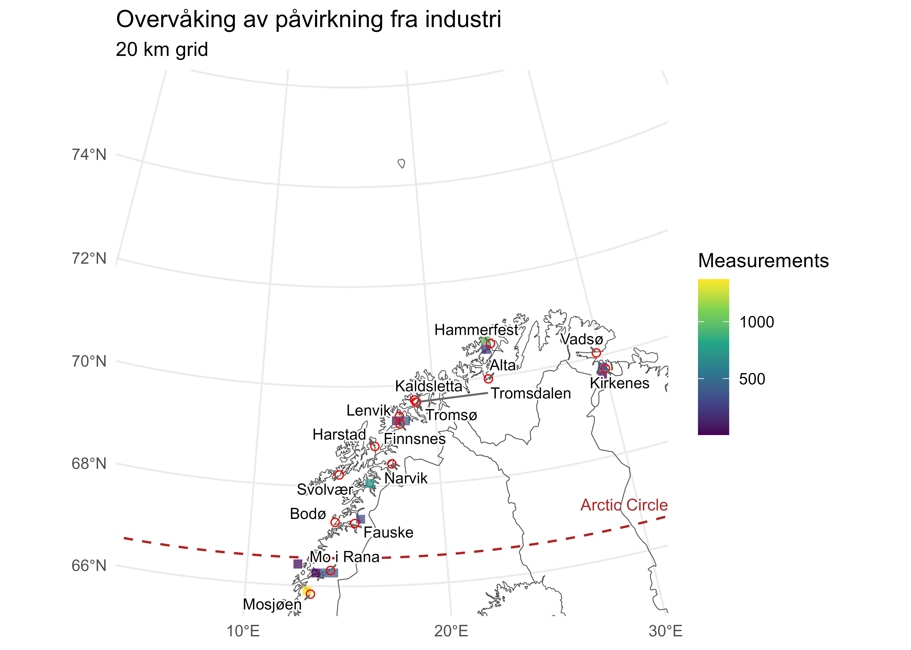](https://sawelch-niva.github.io/Vm2eData/articles/vannmiljo-expect-data_files/figure-html/map-overvaking-av-pavirkning-fra-industri-1.png)

Code

``` r

all_data_reproj_sf_xy |>
  filter(arctic, Aktivitet_navn == "Overvåking av påvirkning fra industri") |>
  group_by(Medium_navn, Parameter_navn) |>
  reframe(n = n()) |>
  filter(n > 10) |>
  left_join(pollutants, by = join_by(Parameter_navn == Name)) |>
  ggplot(mapping = aes(y = Parameter_navn, x = Medium_navn, fill = n)) +
  geom_tile() +
  scale_fill_viridis_c() +
  facet_grid(rows = vars(SubGroupID), scales = "free", space = "free")
```

[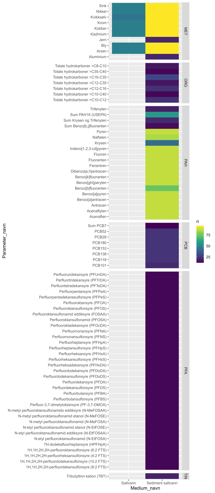](https://sawelch-niva.github.io/Vm2eData/articles/vannmiljo-expect-data_files/figure-html/heatmap-overvaking-av-pavirkning-fra-industri-1.png)

#### Substances monitored per year

Code

``` r

plot_substances_per_year("Overvåking av påvirkning fra industri")
```

[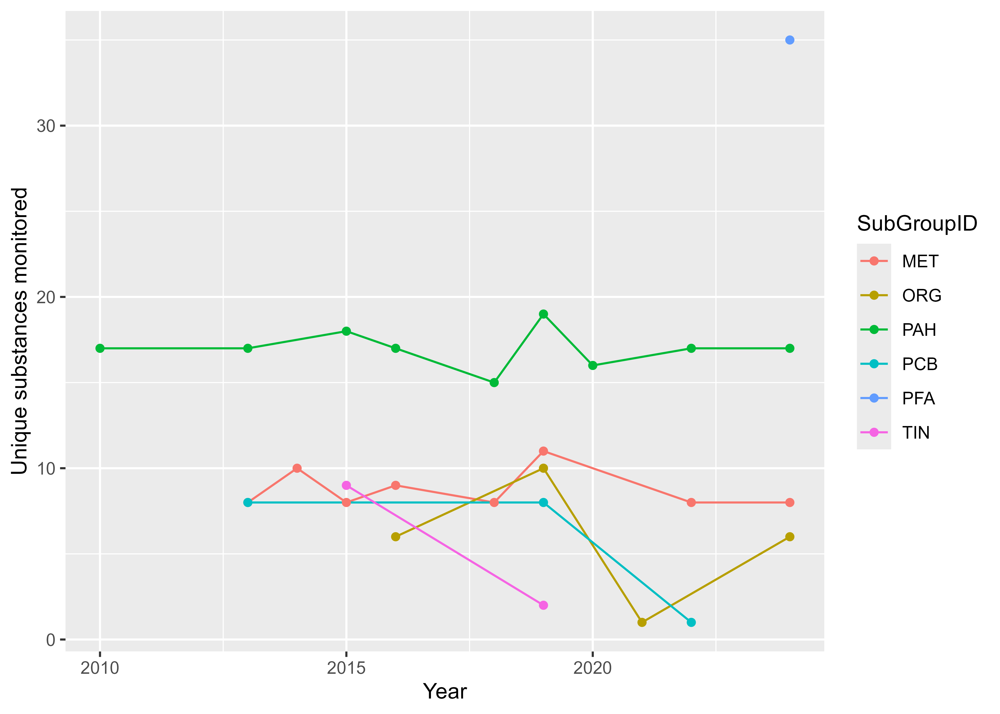](https://sawelch-niva.github.io/Vm2eData/articles/vannmiljo-expect-data_files/figure-html/substances-per-year-overvaking-av-pavirkning-fra-industri-1.png)

### Annet

- Mixed bag, most monitoring tends to be in non-urban areas
- Mostly copper monitoring in sediment, but some other heavy metals and
  organic pollutants.

n = 5770.

Code

``` r

plot_grid_density(
  all_data_reproj_sf_xy |> filter(Aktivitet_navn == "Annet"),
  "Sediment saltvann",
  "viridis",
  "Annet"
)
```

[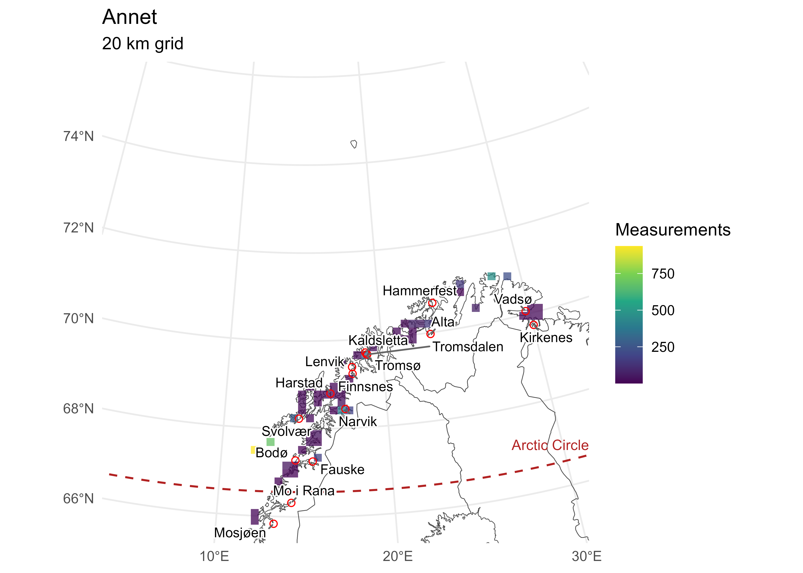](https://sawelch-niva.github.io/Vm2eData/articles/vannmiljo-expect-data_files/figure-html/map-annet-1.png)

Code

``` r

all_data_reproj_sf_xy |>
  filter(arctic, Aktivitet_navn == "Annet") |>
  group_by(Medium_navn, Parameter_navn) |>
  reframe(n = n()) |>
  filter(n > 10) |>
  left_join(pollutants, by = join_by(Parameter_navn == Name)) |>
  ggplot(mapping = aes(y = Parameter_navn, x = Medium_navn, fill = n)) +
  geom_tile() +
  scale_fill_viridis_c() +
  facet_grid(rows = vars(SubGroupID), scales = "free", space = "free")
```

[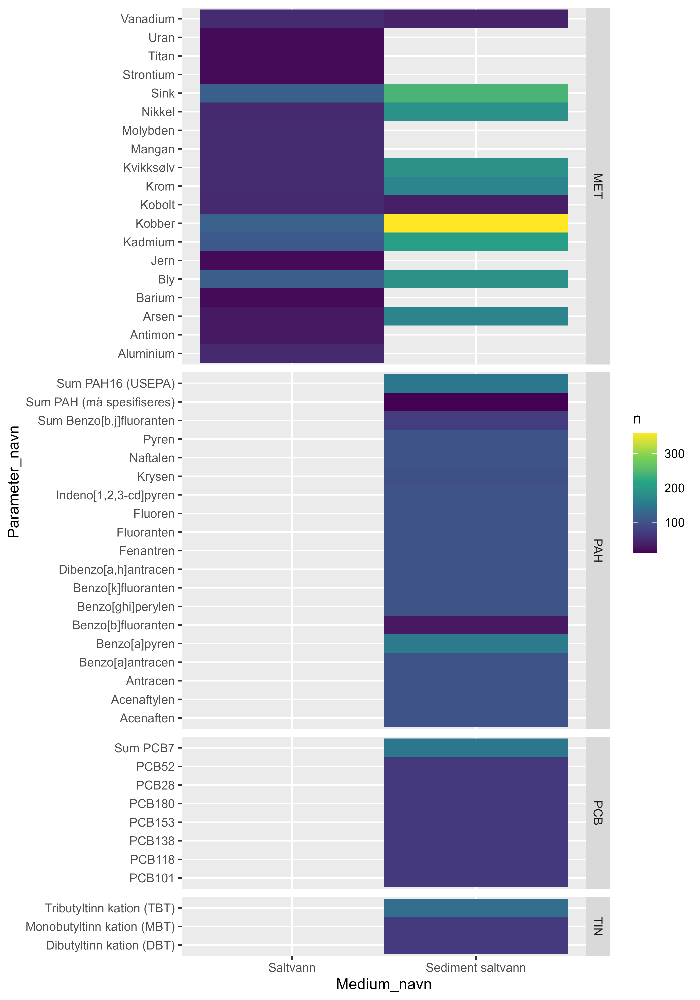](https://sawelch-niva.github.io/Vm2eData/articles/vannmiljo-expect-data_files/figure-html/heatmap-annet-1.png)

#### Substances monitored per year

Code

``` r

plot_substances_per_year("Annet")
```

[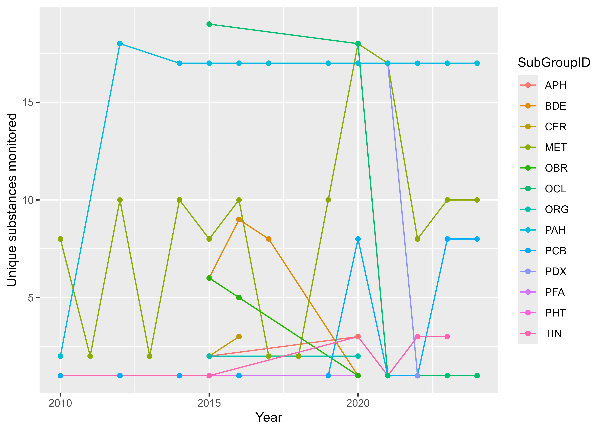](https://sawelch-niva.github.io/Vm2eData/articles/vannmiljo-expect-data_files/figure-html/substances-per-year-annet-1.png)

### Tiltaksorientert overvåking

- Most focused on Tromsø - I’m not certain what counts as a Tiltak and
  what doesn’t.
- PAH in water, metals in sediment

n = 3199.

Code

``` r

plot_grid_density(
  all_data_reproj_sf_xy |>
    filter(Aktivitet_navn == "Tiltaksorientert overvåking"),
  "Sediment saltvann",
  "viridis",
  "Tiltaksorientert overvåking"
)
```

[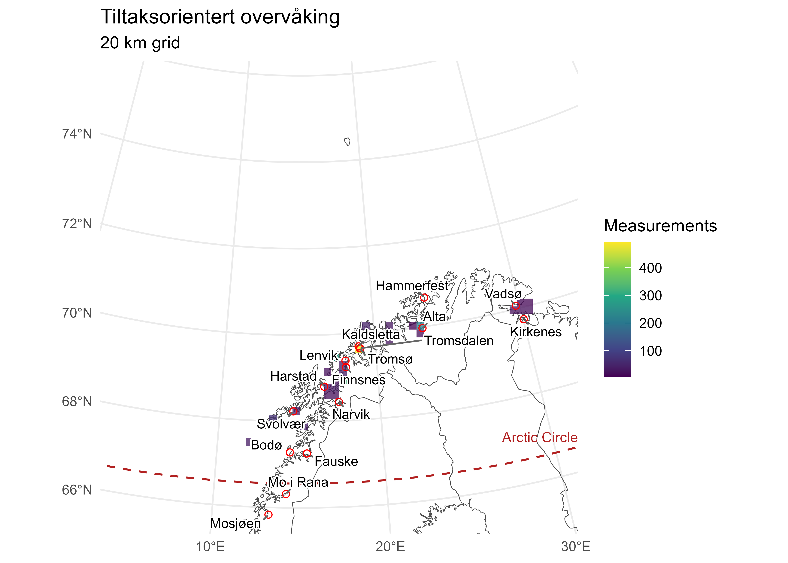](https://sawelch-niva.github.io/Vm2eData/articles/vannmiljo-expect-data_files/figure-html/map-tiltaksorientert-overvaking-1.png)

Code

``` r

all_data_reproj_sf_xy |>
  filter(arctic, Aktivitet_navn == "Tiltaksorientert overvåking") |>
  group_by(Medium_navn, Parameter_navn) |>
  reframe(n = n()) |>
  filter(n > 10) |>
  left_join(pollutants, by = join_by(Parameter_navn == Name)) |>
  ggplot(mapping = aes(y = Parameter_navn, x = Medium_navn, fill = n)) +
  geom_tile() +
  scale_fill_viridis_c() +
  facet_grid(rows = vars(SubGroupID), scales = "free", space = "free")
```

[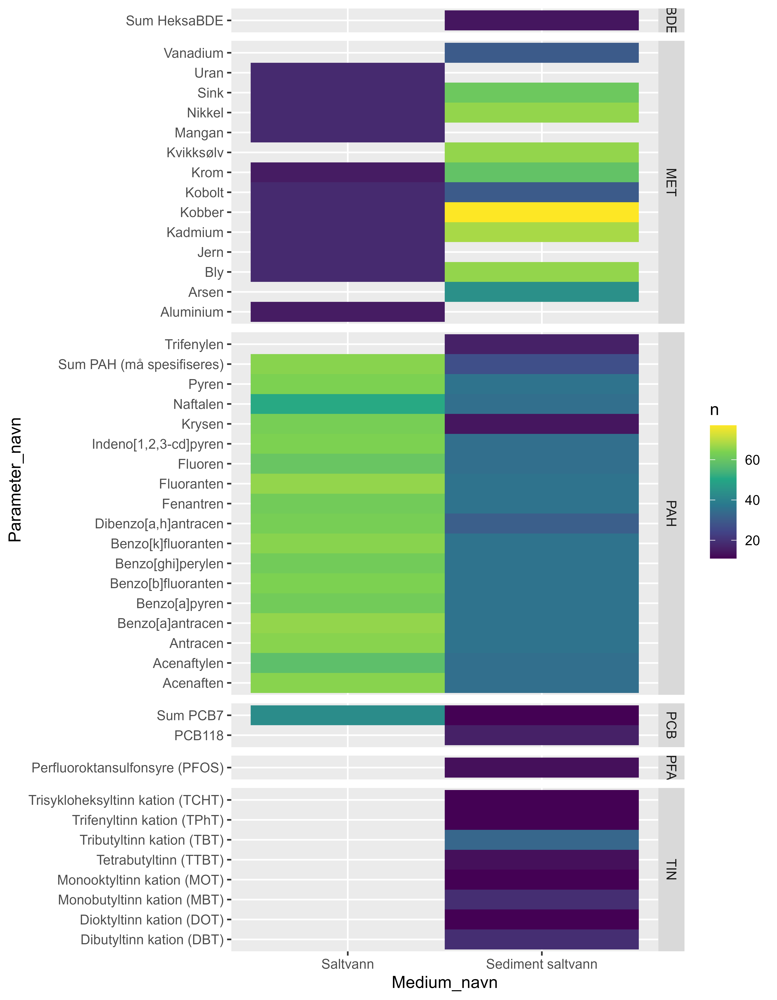](https://sawelch-niva.github.io/Vm2eData/articles/vannmiljo-expect-data_files/figure-html/heatmap-tiltaksorientert-overvaking-1.png)

#### Substances monitored per year

Code

``` r

plot_substances_per_year("Tiltaksorientert overvåking")
```

[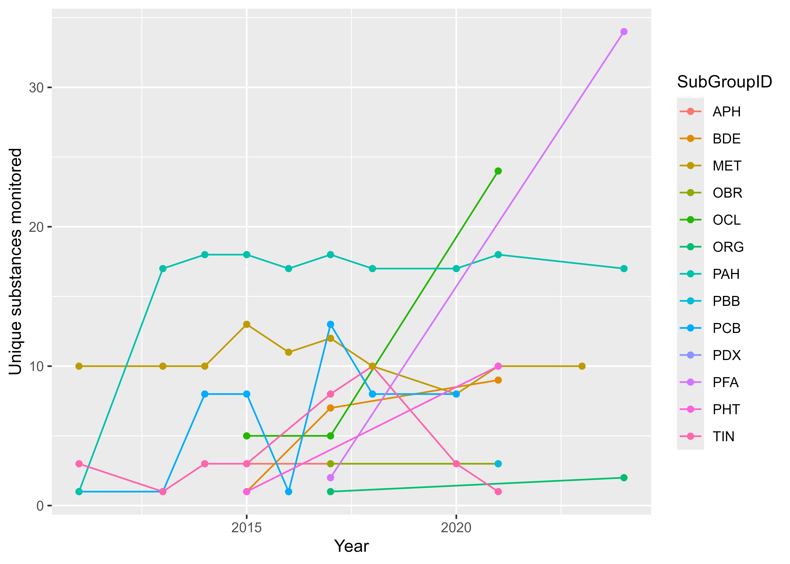](https://sawelch-niva.github.io/Vm2eData/articles/vannmiljo-expect-data_files/figure-html/substances-per-year-tiltaksorientert-overvaking-1.png)

### Mikroplast i kystområder, elver og innsjøer (Mikronor)

- Ignoring

n = 3098.

Code

``` r

plot_grid_density(
  all_data_reproj_sf_xy |>
    filter(
      Aktivitet_navn == "Mikroplast i kystområder, elver og innsjøer (Mikronor)"
    ),
  "Sediment saltvann",
  "viridis",
  "Mikroplast i kystområder, elver og innsjøer (Mikronor)"
)
```

[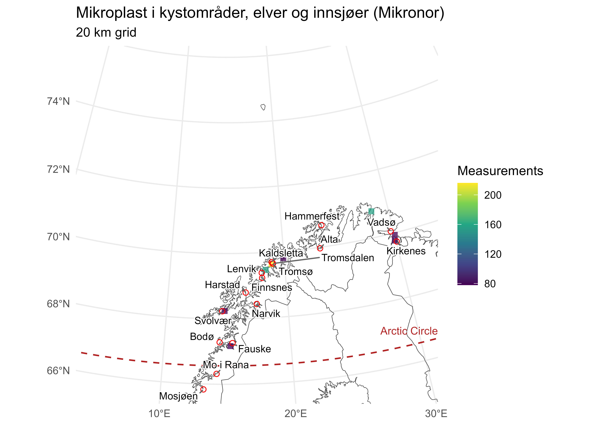](https://sawelch-niva.github.io/Vm2eData/articles/vannmiljo-expect-data_files/figure-html/map-mikroplast-i-kystomrader-elver-og-innsjoer-mikronor-1.png)

Code

``` r

all_data_reproj_sf_xy |>
  filter(
    arctic,
    Aktivitet_navn == "Mikroplast i kystområder, elver og innsjøer (Mikronor)"
  ) |>
  group_by(Medium_navn, Parameter_navn) |>
  reframe(n = n()) |>
  filter(n > 10) |>
  left_join(pollutants, by = join_by(Parameter_navn == Name)) |>
  ggplot(mapping = aes(y = Parameter_navn, x = Medium_navn, fill = n)) +
  geom_tile() +
  scale_fill_viridis_c() +
  facet_grid(rows = vars(SubGroupID), scales = "free", space = "free")
```

[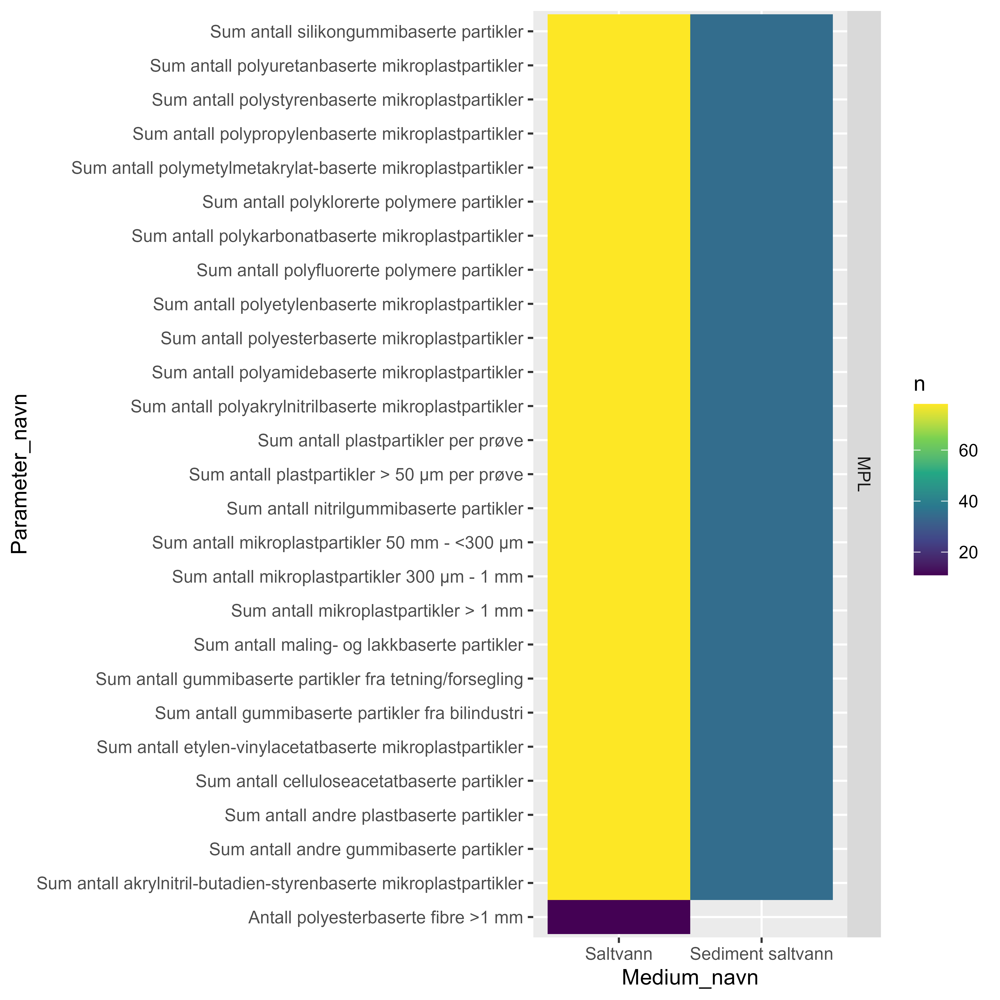](https://sawelch-niva.github.io/Vm2eData/articles/vannmiljo-expect-data_files/figure-html/heatmap-mikroplast-i-kystomrader-elver-og-innsjoer-mikronor-1.png)

#### Substances monitored per year

Code

``` r

plot_substances_per_year(
  "Mikroplast i kystområder, elver og innsjøer (Mikronor)"
)
```

[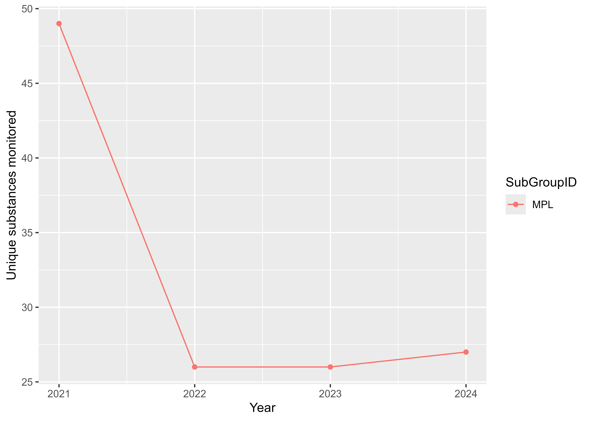](https://sawelch-niva.github.io/Vm2eData/articles/vannmiljo-expect-data_files/figure-html/substances-per-year-mikroplast-i-kystomrader-elver-og-innsjoer-mikronor-1.png)

### Effekter av mudring, utfylling og dumping

- Mostly at a site south of Harstad, and another site NE of Vadsø
- I am personally surprised that Hammerfest isn’t included, because
  there was a lot of dredging to clean up the harbour there
- Good range of metals and PAHs, also PBCs, tin-organics

n = 2936.

Code

``` r

plot_grid_density(
  all_data_reproj_sf_xy |>
    filter(Aktivitet_navn == "Effekter av mudring, utfylling og dumping"),
  "Sediment saltvann",
  "viridis",
  "Effekter av mudring, utfylling og dumping"
)
```

[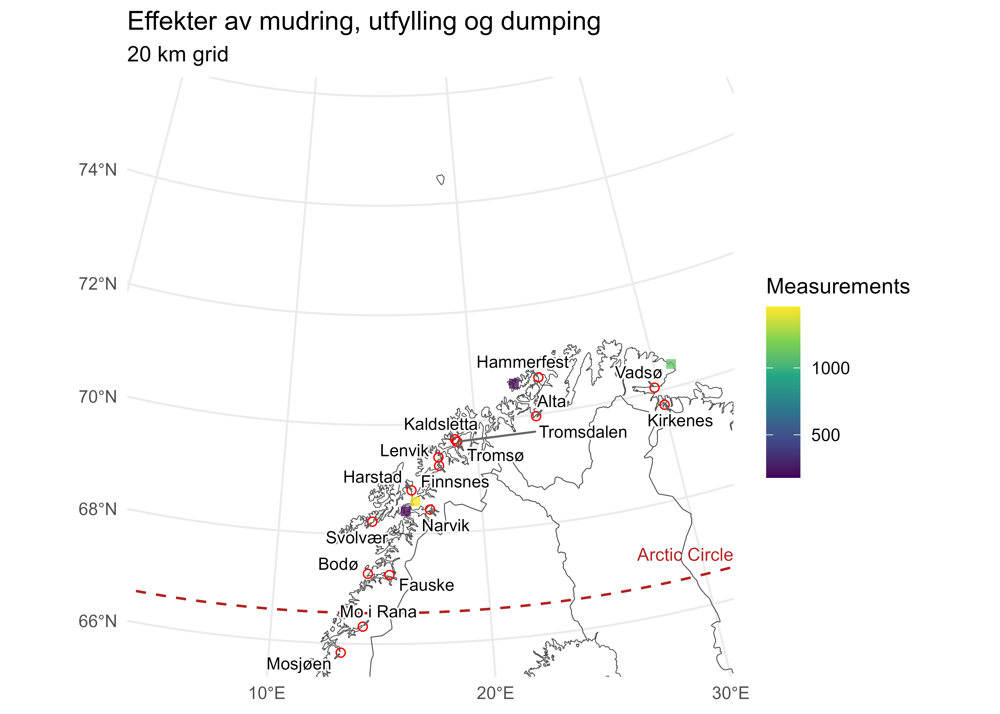](https://sawelch-niva.github.io/Vm2eData/articles/vannmiljo-expect-data_files/figure-html/map-effekter-av-mudring-utfylling-og-dumping-1.png)

Code

``` r

all_data_reproj_sf_xy |>
  filter(
    arctic,
    Aktivitet_navn == "Effekter av mudring, utfylling og dumping"
  ) |>
  group_by(Medium_navn, Parameter_navn) |>
  reframe(n = n()) |>
  filter(n > 10) |>
  left_join(pollutants, by = join_by(Parameter_navn == Name)) |>
  ggplot(mapping = aes(y = Parameter_navn, x = Medium_navn, fill = n)) +
  geom_tile() +
  scale_fill_viridis_c() +
  facet_grid(rows = vars(SubGroupID), scales = "free", space = "free")
```

[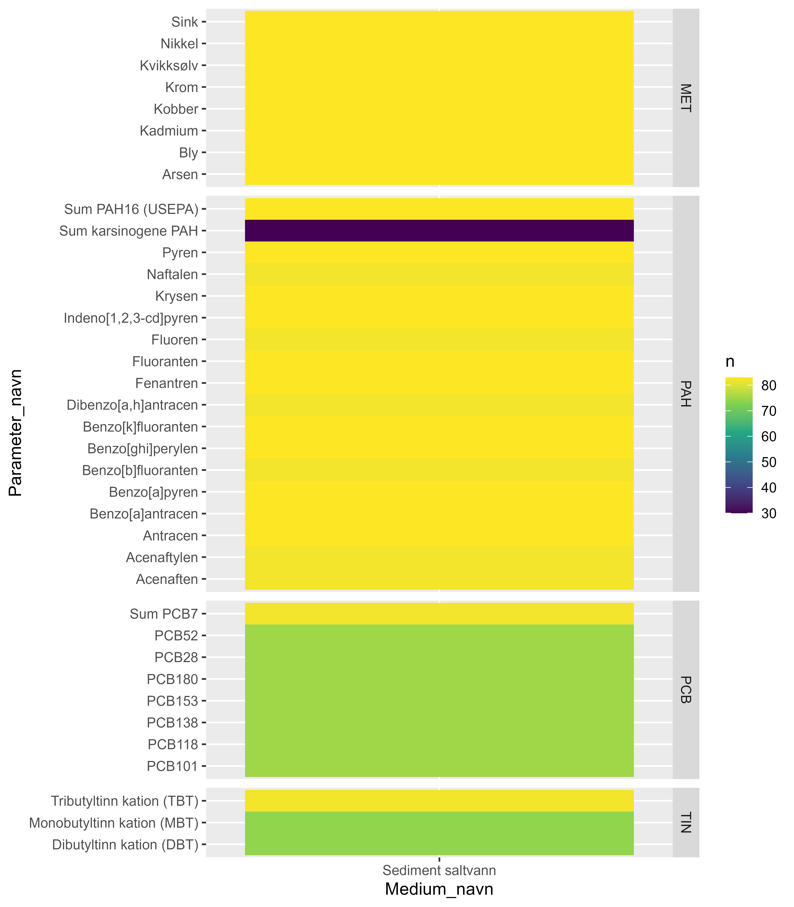](https://sawelch-niva.github.io/Vm2eData/articles/vannmiljo-expect-data_files/figure-html/heatmap-effekter-av-mudring-utfylling-og-dumping-1.png)

#### Substances monitored per year

Code

``` r

plot_substances_per_year("Effekter av mudring, utfylling og dumping")
```

[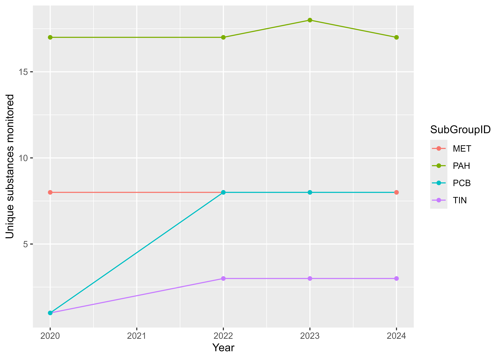](https://sawelch-niva.github.io/Vm2eData/articles/vannmiljo-expect-data_files/figure-html/substances-per-year-effekter-av-mudring-utfylling-og-dumping-1.png)

### Overvåking av avrenning fra landdeponi

- Only two grid squares, semi-remote
- Well-balanced selection of stressors but small sample size

n = 971.

Code

``` r

plot_grid_density(
  all_data_reproj_sf_xy |>
    filter(Aktivitet_navn == "Overvåking av avrenning fra landdeponi"),
  "Sediment saltvann",
  "viridis",
  "Overvåking av avrenning fra landdeponi"
)
```

[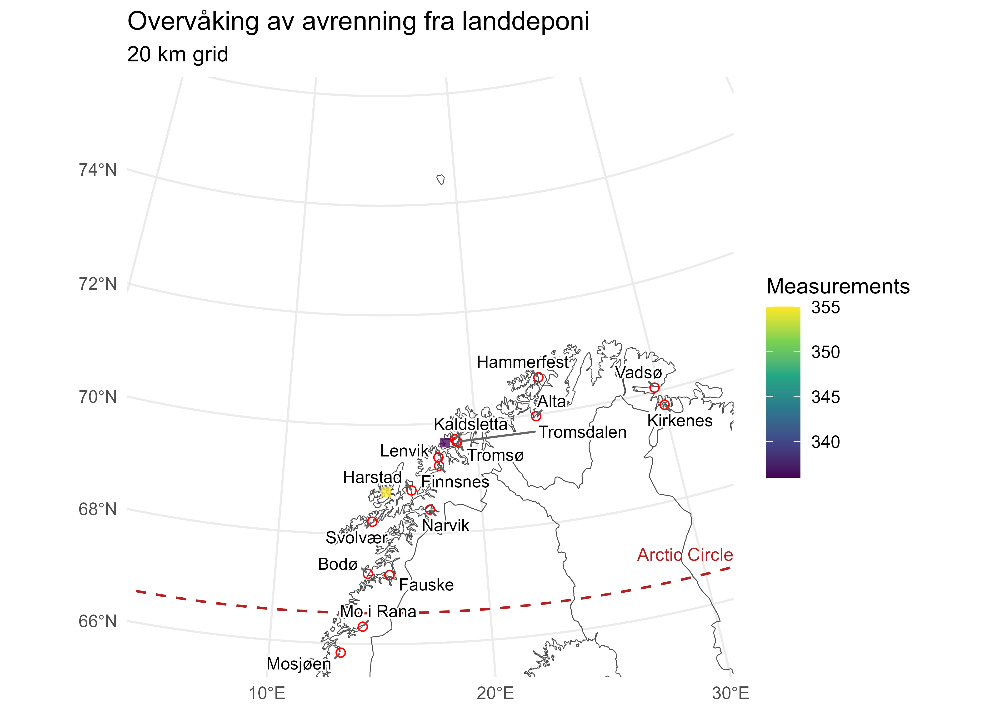](https://sawelch-niva.github.io/Vm2eData/articles/vannmiljo-expect-data_files/figure-html/map-overvaking-av-avrenning-fra-landdeponi-1.png)

Code

``` r

all_data_reproj_sf_xy |>
  filter(arctic, Aktivitet_navn == "Overvåking av avrenning fra landdeponi") |>
  group_by(Medium_navn, Parameter_navn) |>
  reframe(n = n()) |>
  filter(n > 10) |>
  left_join(pollutants, by = join_by(Parameter_navn == Name)) |>
  ggplot(mapping = aes(y = Parameter_navn, x = Medium_navn, fill = n)) +
  geom_tile() +
  scale_fill_viridis_c() +
  facet_grid(rows = vars(SubGroupID), scales = "free", space = "free")
```

[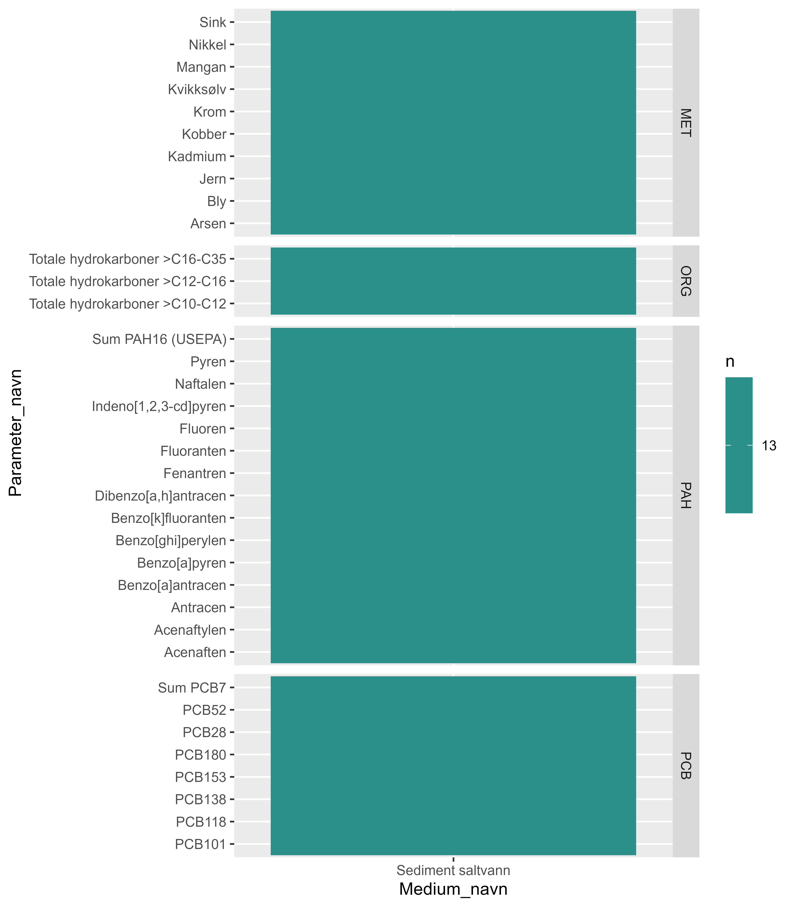](https://sawelch-niva.github.io/Vm2eData/articles/vannmiljo-expect-data_files/figure-html/heatmap-overvaking-av-avrenning-fra-landdeponi-1.png)

#### Substances monitored per year

Code

``` r

plot_substances_per_year("Overvåking av avrenning fra landdeponi")
```

[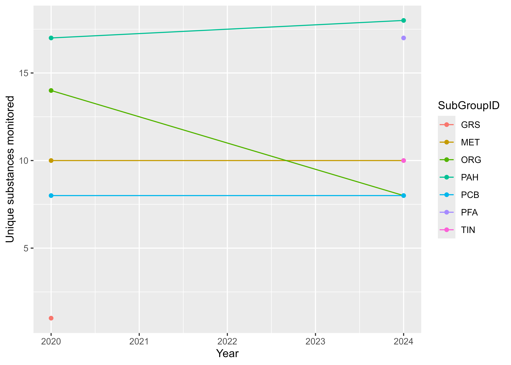](https://sawelch-niva.github.io/Vm2eData/articles/vannmiljo-expect-data_files/figure-html/substances-per-year-overvaking-av-avrenning-fra-landdeponi-1.png)

### Miljøgifter i kystområdene (MilKys)

- 7 sediment samples taken from Tromsø harbour (sediment core? so
  historical data)
- Tested for nearly everything

n = 938.

Code

``` r

plot_grid_density(
  all_data_reproj_sf_xy |>
    filter(Aktivitet_navn == "Miljøgifter i kystområdene (MilKys)"),
  "Sediment saltvann",
  "viridis",
  "Miljøgifter i kystområdene (MilKys)"
)
```

[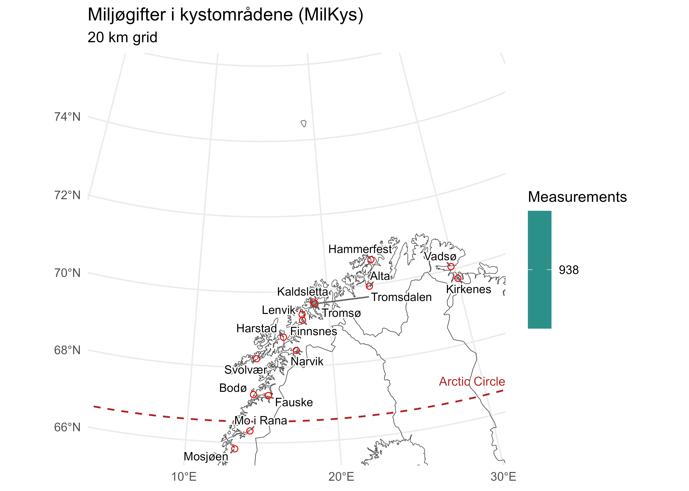](https://sawelch-niva.github.io/Vm2eData/articles/vannmiljo-expect-data_files/figure-html/map-miljogifter-i-kystomradene-milkys-1.png)

Code

``` r

all_data_reproj_sf_xy |>
  filter(arctic, Aktivitet_navn == "Miljøgifter i kystområdene (MilKys)") |>
  group_by(Medium_navn, Parameter_navn) |>
  reframe(n = n()) |>
  left_join(pollutants, by = join_by(Parameter_navn == Name)) |>
  ggplot(mapping = aes(y = Parameter_navn, x = Medium_navn, fill = n)) +
  geom_tile() +
  scale_fill_viridis_c() +
  facet_grid(rows = vars(SubGroupID), scales = "free", space = "free")
```

[](https://sawelch-niva.github.io/Vm2eData/articles/vannmiljo-expect-data_files/figure-html/heatmap-miljogifter-i-kystomradene-milkys-1.png)

#### Substances monitored per year

Code

``` r

plot_substances_per_year("Miljøgifter i kystområdene (MilKys)")
```

[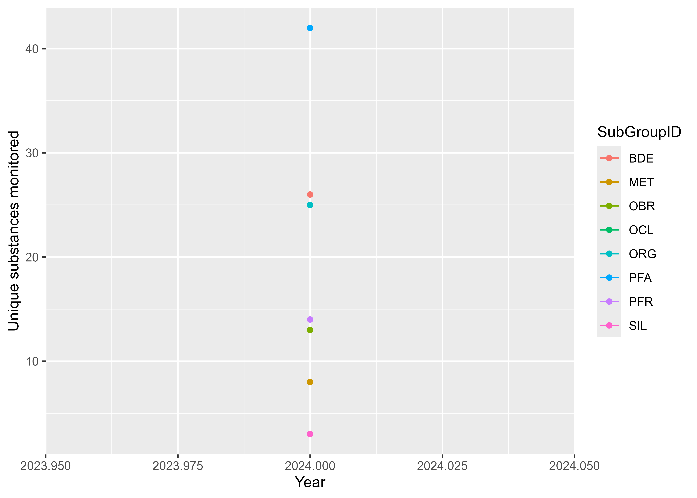](https://sawelch-niva.github.io/Vm2eData/articles/vannmiljo-expect-data_files/figure-html/substances-per-year-miljogifter-i-kystomradene-milkys-1.png)

### Effekter av planlagt arealbruk

- Kirkenes, and two squares in the vicinity of Narvik
- Good range of PAHs, PCBs, Metals in sediment.

n = 919.

Code

``` r

plot_grid_density(
  all_data_reproj_sf_xy |>
    filter(Aktivitet_navn == "Effekter av planlagt arealbruk"),
  "Sediment saltvann",
  "viridis",
  "Effekter av planlagt arealbruk"
)
```

[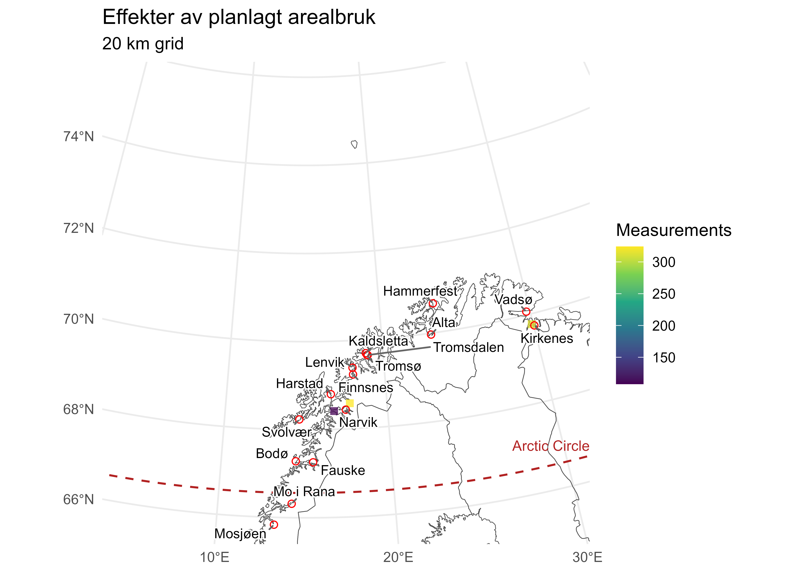](https://sawelch-niva.github.io/Vm2eData/articles/vannmiljo-expect-data_files/figure-html/map-effekter-av-planlagt-arealbruk-1.png)

Code

``` r

all_data_reproj_sf_xy |>
  filter(arctic, Aktivitet_navn == "Effekter av planlagt arealbruk") |>
  group_by(Medium_navn, Parameter_navn) |>
  reframe(n = n()) |>
  filter(n > 10) |>
  left_join(pollutants, by = join_by(Parameter_navn == Name)) |>
  ggplot(mapping = aes(y = Parameter_navn, x = Medium_navn, fill = n)) +
  geom_tile() +
  scale_fill_viridis_c() +
  facet_grid(rows = vars(SubGroupID), scales = "free", space = "free")
```

[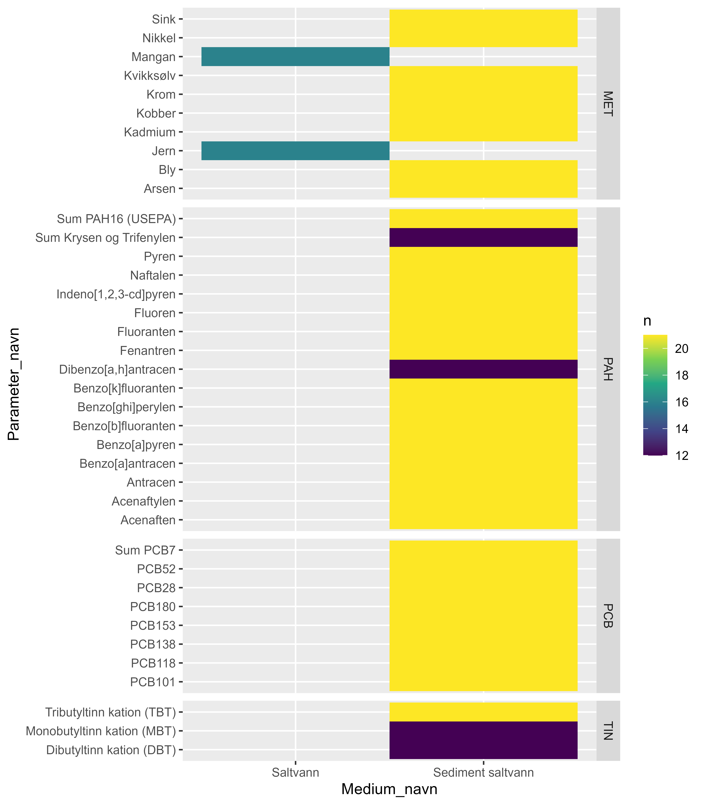](https://sawelch-niva.github.io/Vm2eData/articles/vannmiljo-expect-data_files/figure-html/heatmap-effekter-av-planlagt-arealbruk-1.png)

#### Substances monitored per year

Code

``` r

plot_substances_per_year("Effekter av planlagt arealbruk")
```

[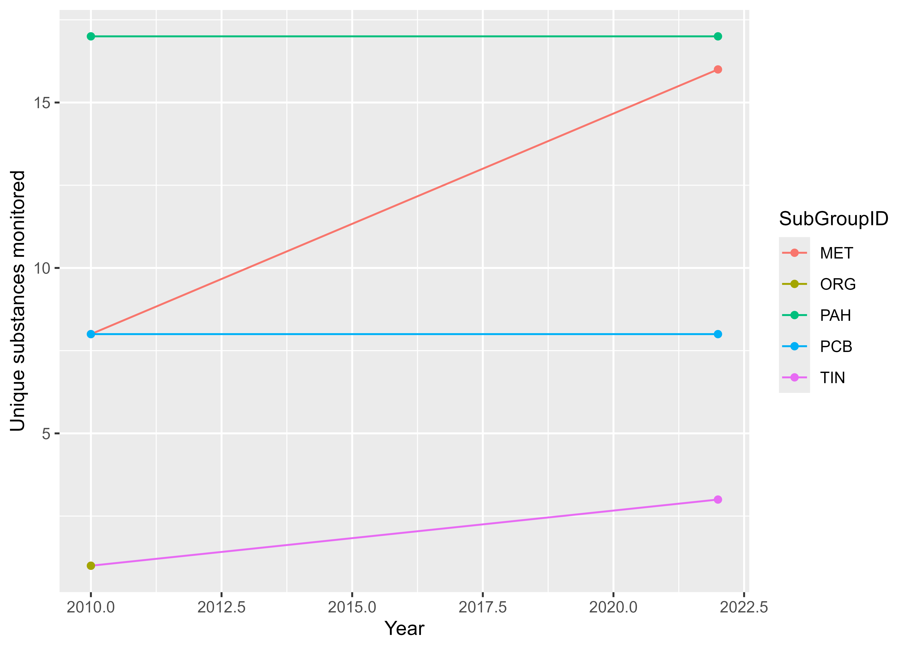](https://sawelch-niva.github.io/Vm2eData/articles/vannmiljo-expect-data_files/figure-html/substances-per-year-effekter-av-planlagt-arealbruk-1.png)

### Problemkartlegging

- Alta, Hammerfest, multiple squares in vicinity of Harstad
- Mostly metals but some PAHs and other substances

n = 896.

Code

``` r

plot_grid_density(
  all_data_reproj_sf_xy |> filter(Aktivitet_navn == "Problemkartlegging"),
  "Sediment saltvann",
  "viridis",
  "Problemkartlegging"
)
```

[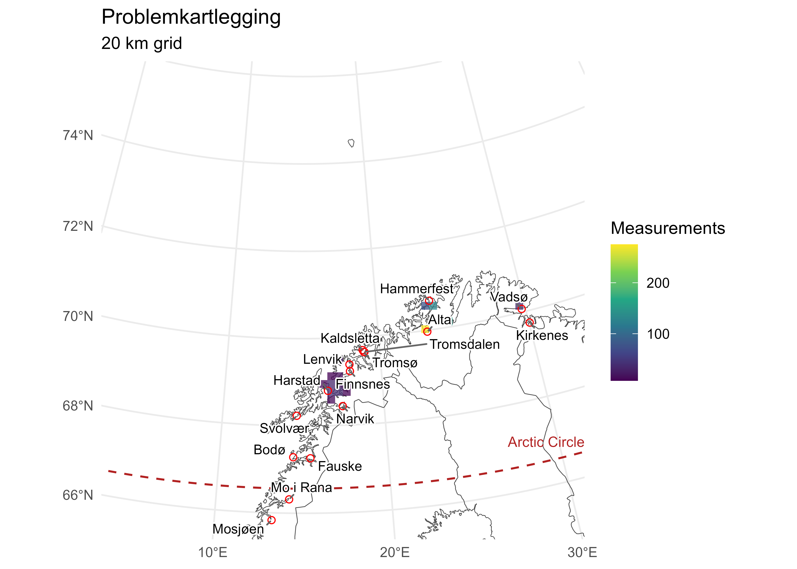](https://sawelch-niva.github.io/Vm2eData/articles/vannmiljo-expect-data_files/figure-html/map-problemkartlegging-1.png)

Code

``` r

all_data_reproj_sf_xy |>
  filter(arctic, Aktivitet_navn == "Problemkartlegging") |>
  group_by(Medium_navn, Parameter_navn) |>
  reframe(n = n()) |>
  filter(n > 10) |>
  left_join(pollutants, by = join_by(Parameter_navn == Name)) |>
  ggplot(mapping = aes(y = Parameter_navn, x = Medium_navn, fill = n)) +
  geom_tile() +
  scale_fill_viridis_c() +
  facet_grid(rows = vars(SubGroupID), scales = "free", space = "free")
```

[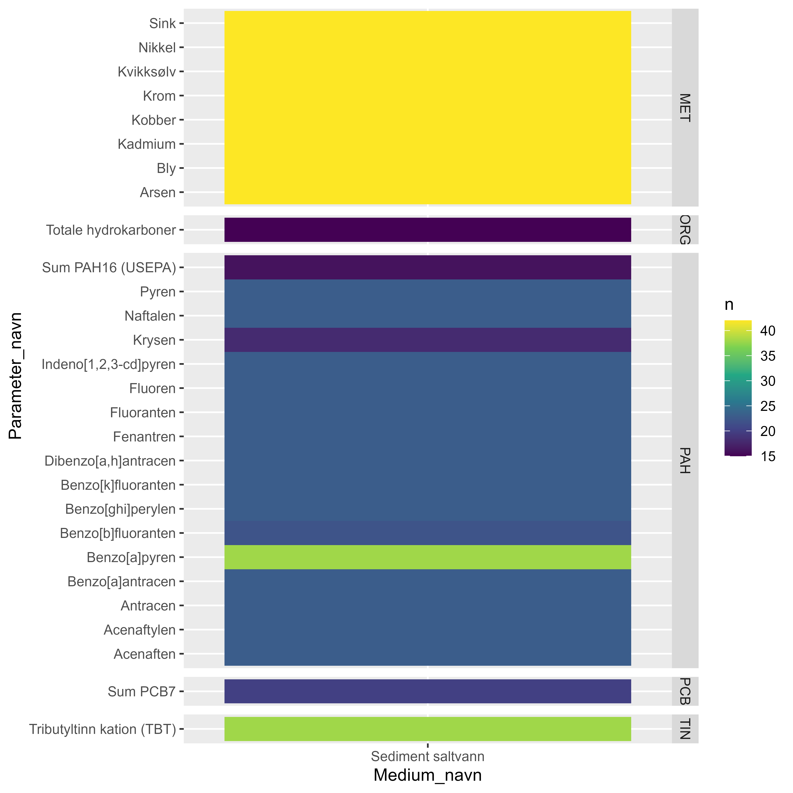](https://sawelch-niva.github.io/Vm2eData/articles/vannmiljo-expect-data_files/figure-html/heatmap-problemkartlegging-1.png)

#### Substances monitored per year

Code

``` r

plot_substances_per_year("Problemkartlegging")
```

[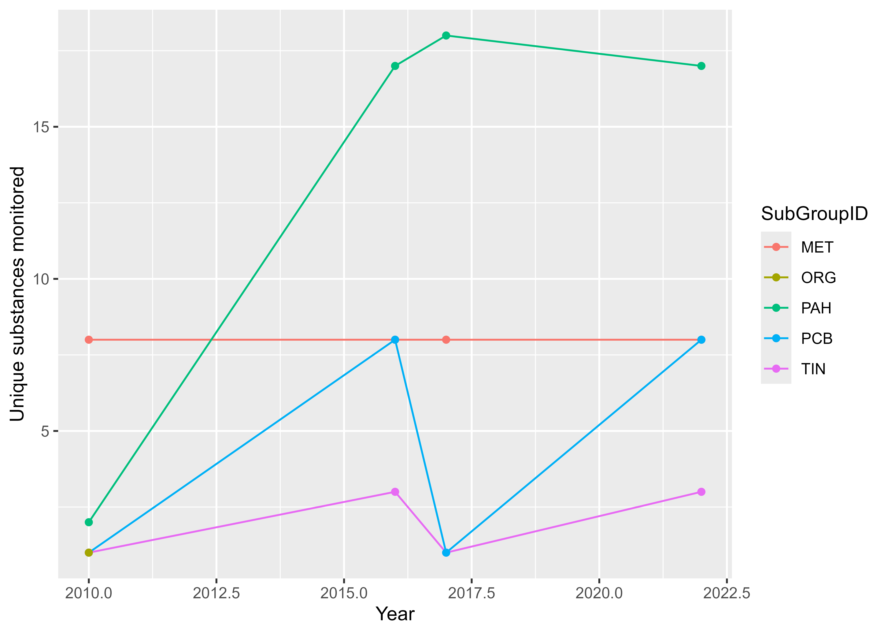](https://sawelch-niva.github.io/Vm2eData/articles/vannmiljo-expect-data_files/figure-html/substances-per-year-problemkartlegging-1.png)

### Overvåking av påvirkning fra flyplasser

- Mostly Tromsø, some Alta
- Iron, manganese, few organic substances, occasional PFA except for
  N-EtFOSAA which is measured a lot.

n = 693.

Code

``` r

plot_grid_density(
  all_data_reproj_sf_xy |>
    filter(Aktivitet_navn == "Overvåking av påvirkning fra flyplasser"),
  "Sediment saltvann",
  "viridis",
  "Overvåking av påvirkning fra flyplasser"
)
```

[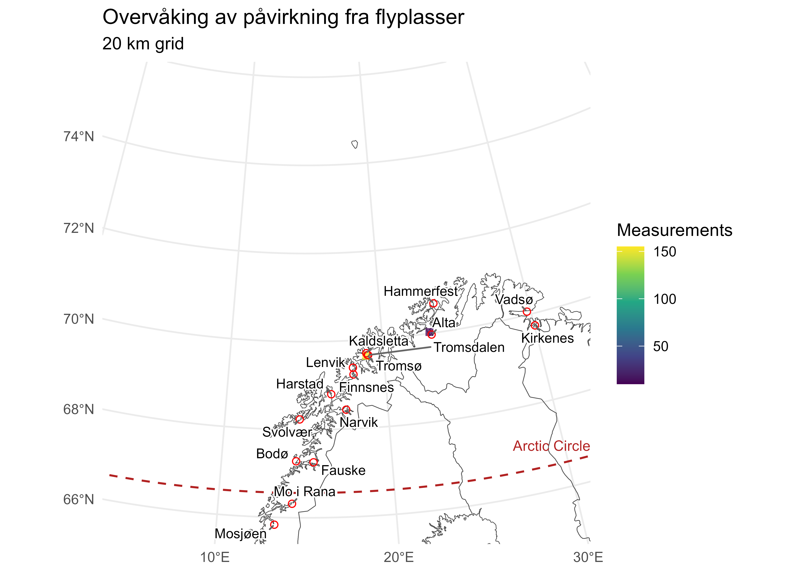](https://sawelch-niva.github.io/Vm2eData/articles/vannmiljo-expect-data_files/figure-html/map-overvaking-av-pavirkning-fra-flyplasser-1.png)

Code

``` r

all_data_reproj_sf_xy |>
  filter(arctic, Aktivitet_navn == "Overvåking av påvirkning fra flyplasser") |>
  group_by(Medium_navn, Parameter_navn) |>
  reframe(n = n()) |>
  filter(n > 10) |>
  left_join(pollutants, by = join_by(Parameter_navn == Name)) |>
  ggplot(mapping = aes(y = Parameter_navn, x = Medium_navn, fill = n)) +
  geom_tile() +
  scale_fill_viridis_c() +
  facet_grid(rows = vars(SubGroupID), scales = "free", space = "free")
```

[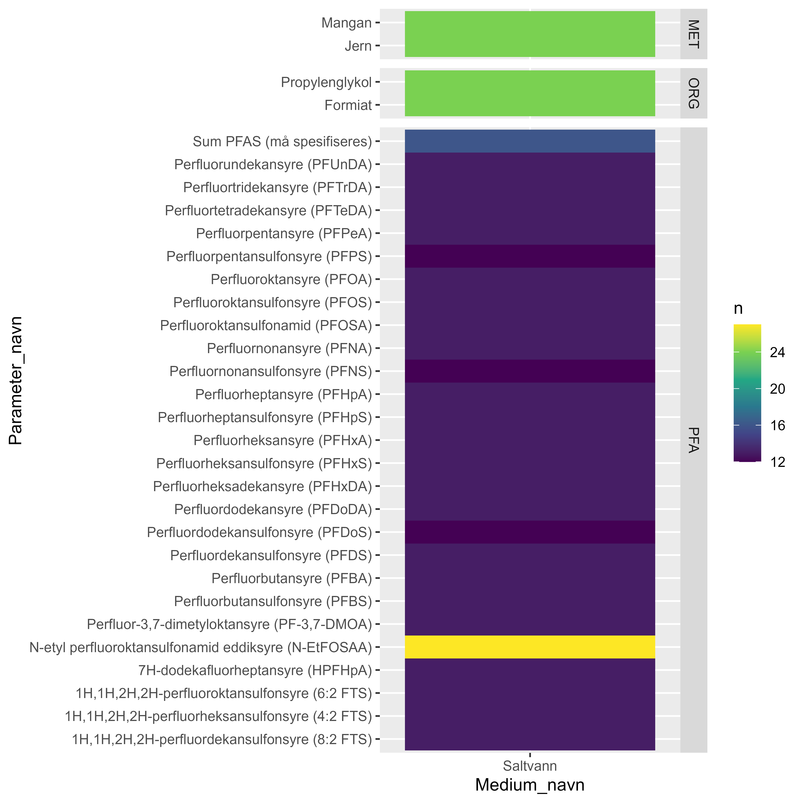](https://sawelch-niva.github.io/Vm2eData/articles/vannmiljo-expect-data_files/figure-html/heatmap-overvaking-av-pavirkning-fra-flyplasser-1.png)

#### Substances monitored per year

Code

``` r

plot_substances_per_year("Overvåking av påvirkning fra flyplasser")
```

[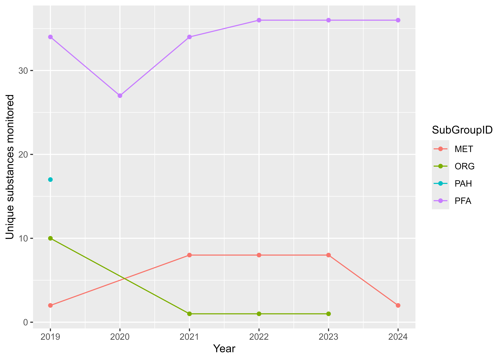](https://sawelch-niva.github.io/Vm2eData/articles/vannmiljo-expect-data_files/figure-html/substances-per-year-overvaking-av-pavirkning-fra-flyplasser-1.png)

### Overvåking av påvirkning fra avløp

n = 583.

- Hammerfest but mostly Tromsø
- Metals and PAHs, plus some minimal extras

Code

``` r

plot_grid_density(
  all_data_reproj_sf_xy |>
    filter(Aktivitet_navn == "Overvåking av påvirkning fra avløp"),
  "Sediment saltvann",
  "viridis",
  "Overvåking av påvirkning fra avløp"
)
```

[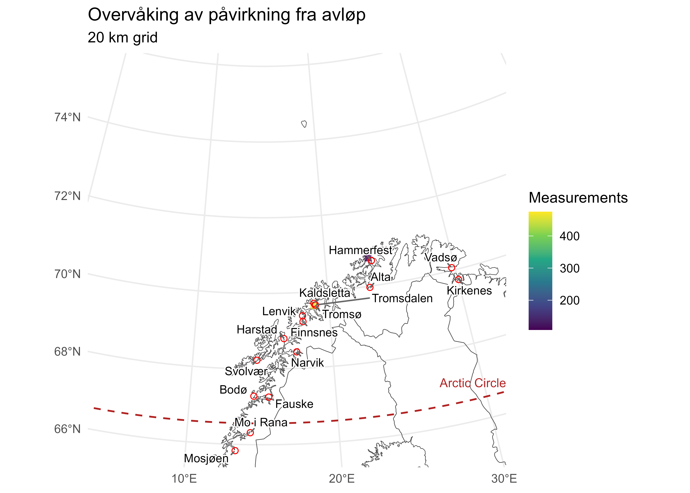](https://sawelch-niva.github.io/Vm2eData/articles/vannmiljo-expect-data_files/figure-html/map-overvaking-av-pavirkning-fra-avlop-1.png)

Code

``` r

all_data_reproj_sf_xy |>
  filter(arctic, Aktivitet_navn == "Overvåking av påvirkning fra avløp") |>
  group_by(Medium_navn, Parameter_navn) |>
  reframe(n = n()) |>
  filter(n > 10) |>
  left_join(pollutants, by = join_by(Parameter_navn == Name)) |>
  ggplot(mapping = aes(y = Parameter_navn, x = Medium_navn, fill = n)) +
  geom_tile() +
  scale_fill_viridis_c() +
  facet_grid(rows = vars(SubGroupID), scales = "free", space = "free")
```

[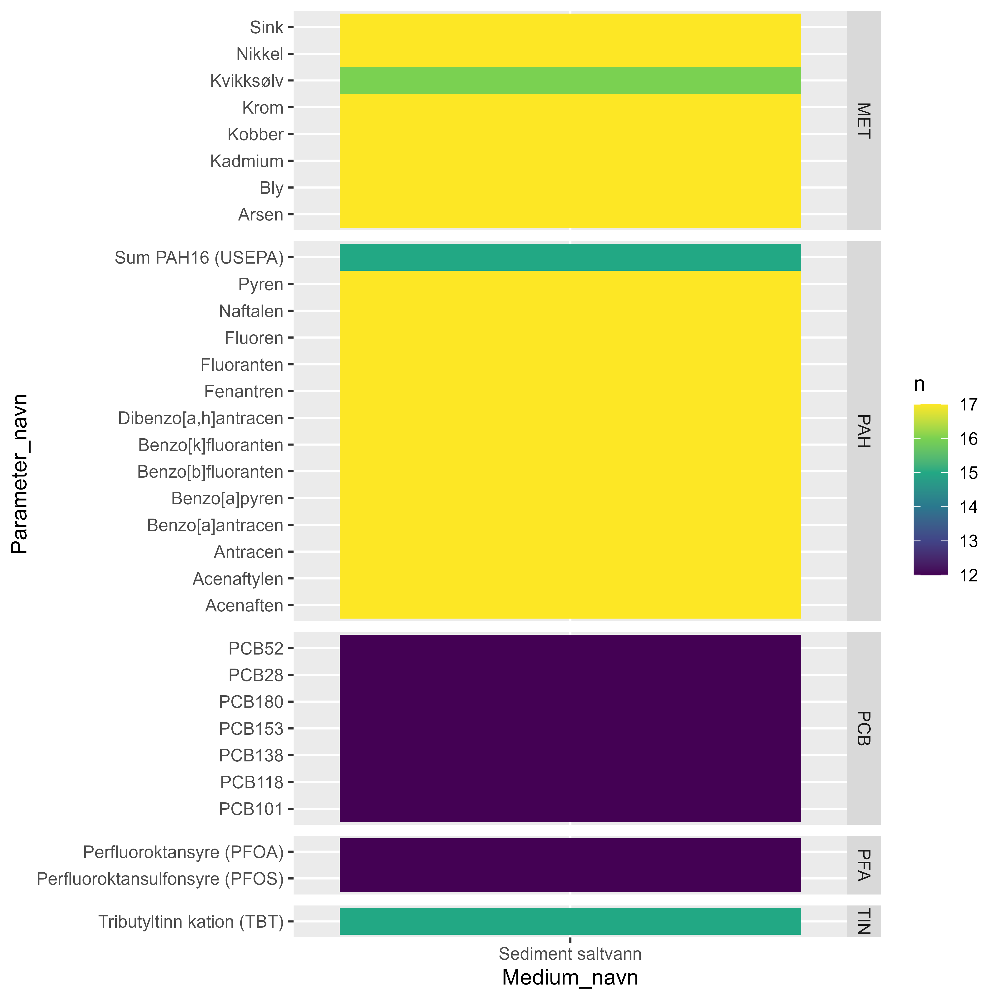](https://sawelch-niva.github.io/Vm2eData/articles/vannmiljo-expect-data_files/figure-html/heatmap-overvaking-av-pavirkning-fra-avlop-1.png)

#### Substances monitored per year

Code

``` r

plot_substances_per_year("Overvåking av påvirkning fra avløp")
```

[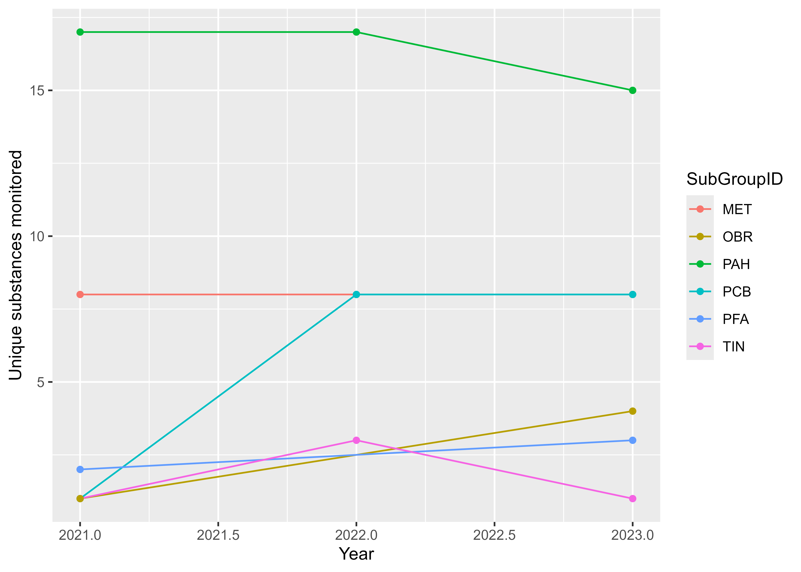](https://sawelch-niva.github.io/Vm2eData/articles/vannmiljo-expect-data_files/figure-html/substances-per-year-overvaking-av-pavirkning-fra-avlop-1.png)

### Tilførselsprogrammet

- Looks irrelevant

n = 578.

Code

``` r

plot_grid_density(
  all_data_reproj_sf_xy |> filter(Aktivitet_navn == "Tilførselsprogrammet"),
  "Sediment saltvann",
  "viridis",
  "Tilførselsprogrammet"
)
```

[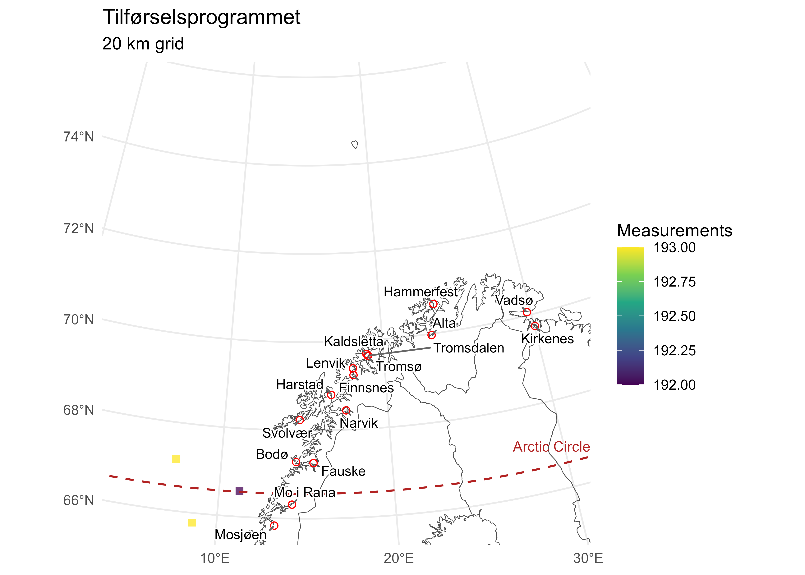](https://sawelch-niva.github.io/Vm2eData/articles/vannmiljo-expect-data_files/figure-html/map-tilforselsprogrammet-1.png)

Code

``` r

all_data_reproj_sf_xy |>
  filter(arctic, Aktivitet_navn == "Tilførselsprogrammet") |>
  group_by(Medium_navn, Parameter_navn) |>
  reframe(n = n()) |>
  left_join(pollutants, by = join_by(Parameter_navn == Name)) |>
  ggplot(mapping = aes(y = Parameter_navn, x = Medium_navn, fill = n)) +
  geom_tile() +
  scale_fill_viridis_c() +
  facet_grid(rows = vars(SubGroupID), scales = "free", space = "free")
```

[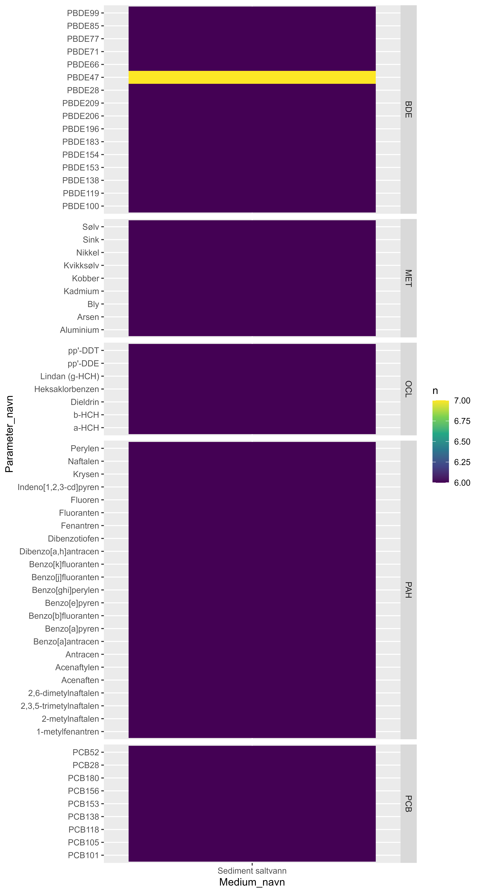](https://sawelch-niva.github.io/Vm2eData/articles/vannmiljo-expect-data_files/figure-html/heatmap-tilforselsprogrammet-1.png)

#### Substances monitored per year

Code

``` r

plot_substances_per_year("Tilførselsprogrammet")
```

[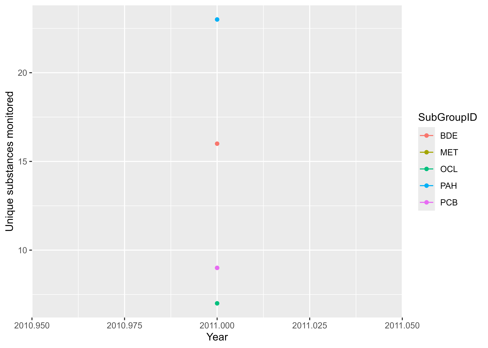](https://sawelch-niva.github.io/Vm2eData/articles/vannmiljo-expect-data_files/figure-html/substances-per-year-tilforselsprogrammet-1.png)

### Overvåking av påvirkning fra vegtrafikk

n = 465.

- Metals in some not especially urban zones

Code

``` r

plot_grid_density(
  all_data_reproj_sf_xy |>
    filter(Aktivitet_navn == "Overvåking av påvirkning fra vegtrafikk"),
  "Sediment saltvann",
  "viridis",
  "Overvåking av påvirkning fra vegtrafikk"
)
```

[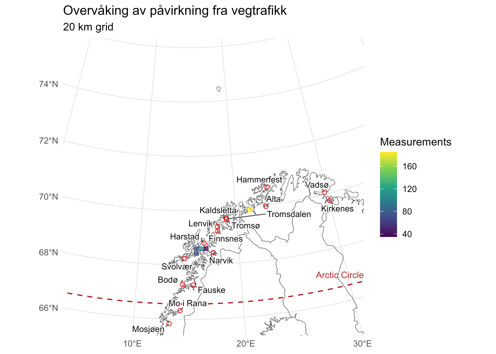](https://sawelch-niva.github.io/Vm2eData/articles/vannmiljo-expect-data_files/figure-html/map-overvaking-av-pavirkning-fra-vegtrafikk-1.png)

Code

``` r

all_data_reproj_sf_xy |>
  filter(arctic, Aktivitet_navn == "Overvåking av påvirkning fra vegtrafikk") |>
  group_by(Medium_navn, Parameter_navn) |>
  reframe(n = n()) |>
  filter(n > 10) |>
  left_join(pollutants, by = join_by(Parameter_navn == Name)) |>
  ggplot(mapping = aes(y = Parameter_navn, x = Medium_navn, fill = n)) +
  geom_tile() +
  scale_fill_viridis_c() +
  facet_grid(rows = vars(SubGroupID), scales = "free", space = "free")
```

[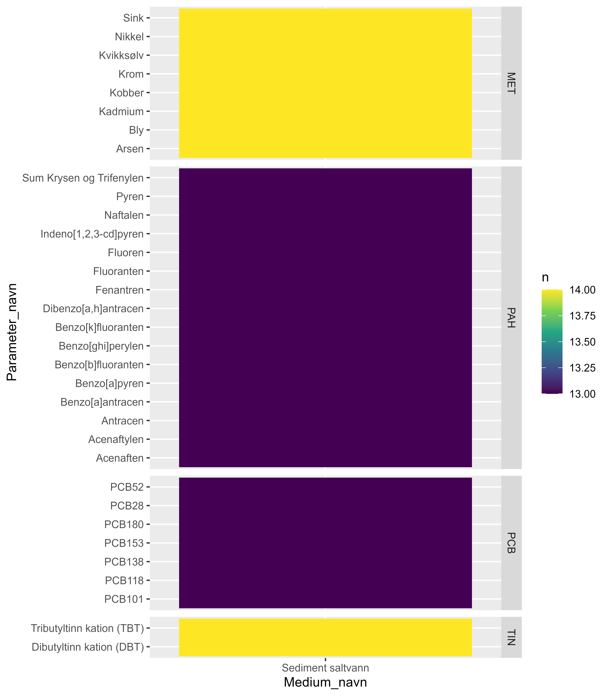](https://sawelch-niva.github.io/Vm2eData/articles/vannmiljo-expect-data_files/figure-html/heatmap-overvaking-av-pavirkning-fra-vegtrafikk-1.png)

#### Substances monitored per year

Code

``` r

plot_substances_per_year("Overvåking av påvirkning fra vegtrafikk")
```

[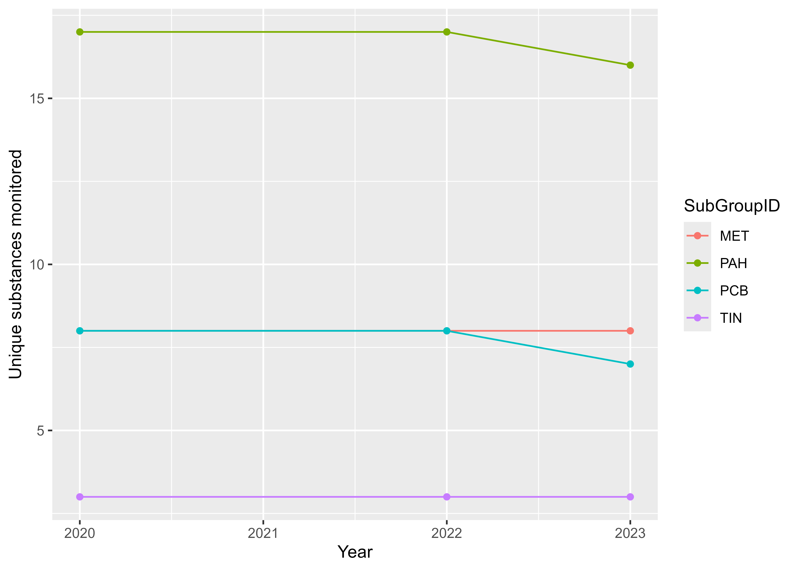](https://sawelch-niva.github.io/Vm2eData/articles/vannmiljo-expect-data_files/figure-html/substances-per-year-overvaking-av-pavirkning-fra-vegtrafikk-1.png)

### Myndighetspålagt forurensningsovervåking

- Mixed bag of metals in some urban areas

n = 445.

Code

``` r

plot_grid_density(
  all_data_reproj_sf_xy |>
    filter(Aktivitet_navn == "Myndighetspålagt forurensningsovervåking"),
  "Sediment saltvann",
  "viridis",
  "Myndighetspålagt forurensningsovervåking"
)
```

[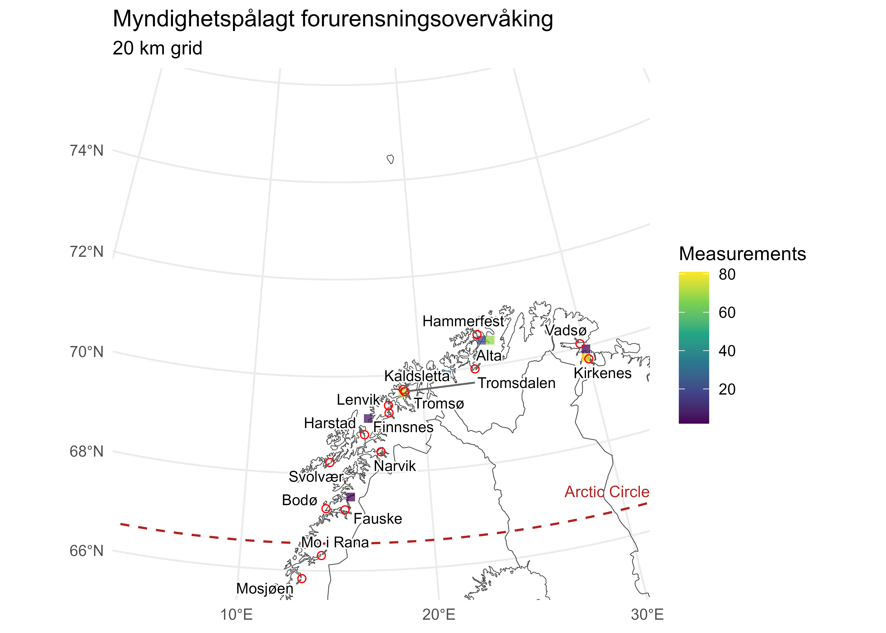](https://sawelch-niva.github.io/Vm2eData/articles/vannmiljo-expect-data_files/figure-html/map-myndighetspalagt-forurensningsovervaking-1.png)

Code

``` r

all_data_reproj_sf_xy |>
  filter(
    arctic,
    Aktivitet_navn == "Myndighetspålagt forurensningsovervåking"
  ) |>
  group_by(Medium_navn, Parameter_navn) |>
  reframe(n = n()) |>
  filter(n > 10) |>
  left_join(pollutants, by = join_by(Parameter_navn == Name)) |>
  ggplot(mapping = aes(y = Parameter_navn, x = Medium_navn, fill = n)) +
  geom_tile() +
  scale_fill_viridis_c() +
  facet_grid(rows = vars(SubGroupID), scales = "free", space = "free")
```

[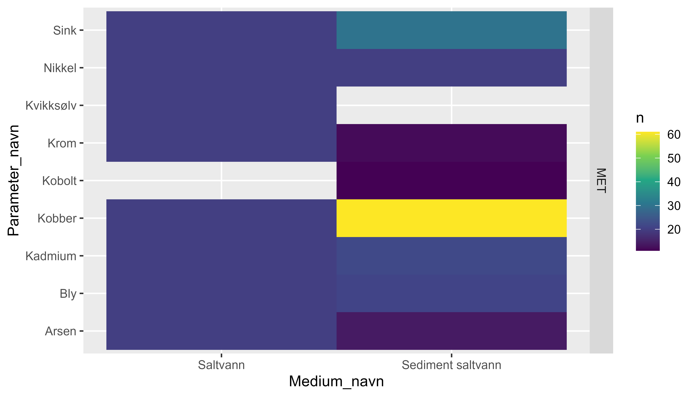](https://sawelch-niva.github.io/Vm2eData/articles/vannmiljo-expect-data_files/figure-html/heatmap-myndighetspalagt-forurensningsovervaking-1.png)

#### Substances monitored per year

Code

``` r

plot_substances_per_year("Myndighetspålagt forurensningsovervåking")
```

[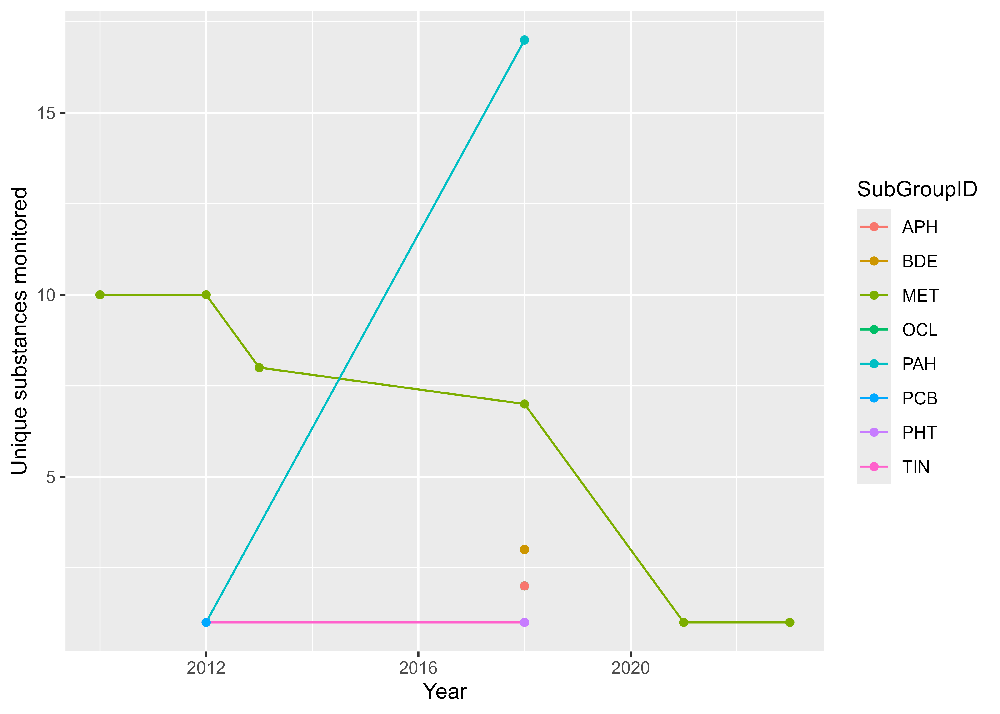](https://sawelch-niva.github.io/Vm2eData/articles/vannmiljo-expect-data_files/figure-html/substances-per-year-myndighetspalagt-forurensningsovervaking-1.png)

### Basisovervåking - påvirka områder

- Metal/PAH/PCB/tin workup in two squares SW of Svolvær

n = 324.

Code

``` r

plot_grid_density(
  all_data_reproj_sf_xy |>
    filter(Aktivitet_navn == "Basisovervåking - påvirka områder"),
  "Sediment saltvann",
  "viridis",
  "Basisovervåking - påvirka områder"
)
```

[](https://sawelch-niva.github.io/Vm2eData/articles/vannmiljo-expect-data_files/figure-html/map-basisovervaking-pavirka-omrader-1.png)

Code

``` r

all_data_reproj_sf_xy |>
  filter(arctic, Aktivitet_navn == "Basisovervåking - påvirka områder") |>
  group_by(Medium_navn, Parameter_navn) |>
  reframe(n = n()) |>
  left_join(pollutants, by = join_by(Parameter_navn == Name)) |>
  ggplot(mapping = aes(y = Parameter_navn, x = Medium_navn, fill = n)) +
  geom_tile() +
  scale_fill_viridis_c() +
  facet_grid(rows = vars(SubGroupID), scales = "free", space = "free")
```

[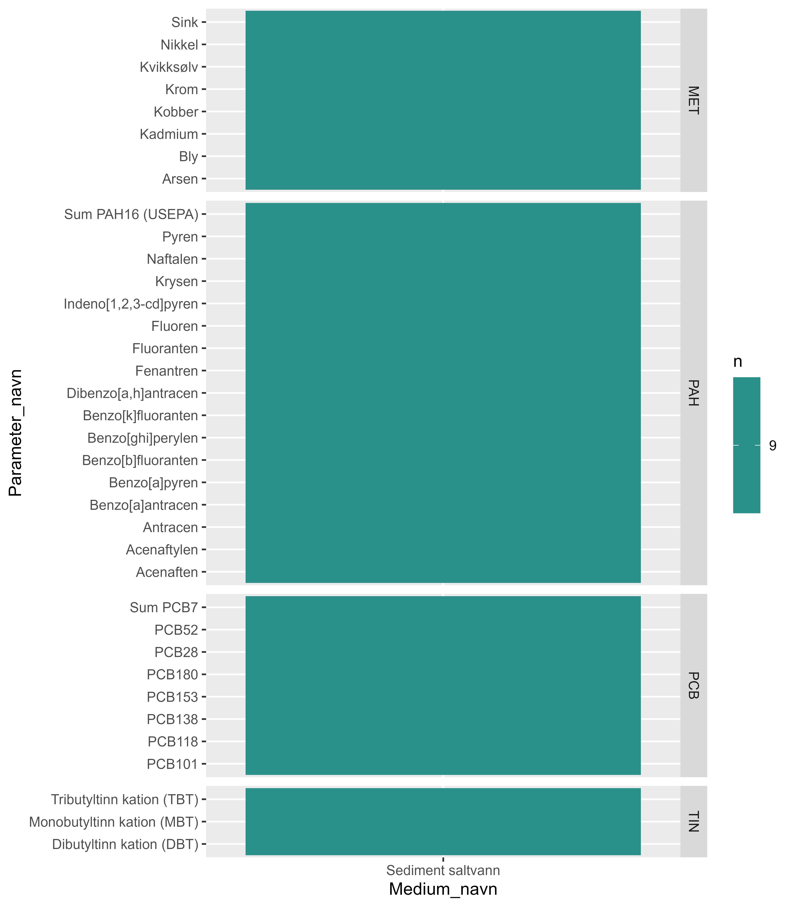](https://sawelch-niva.github.io/Vm2eData/articles/vannmiljo-expect-data_files/figure-html/heatmap-basisovervaking-pavirka-omrader-1.png)

#### Substances monitored per year

Code

``` r

plot_substances_per_year("Basisovervåking - påvirka områder")
```

[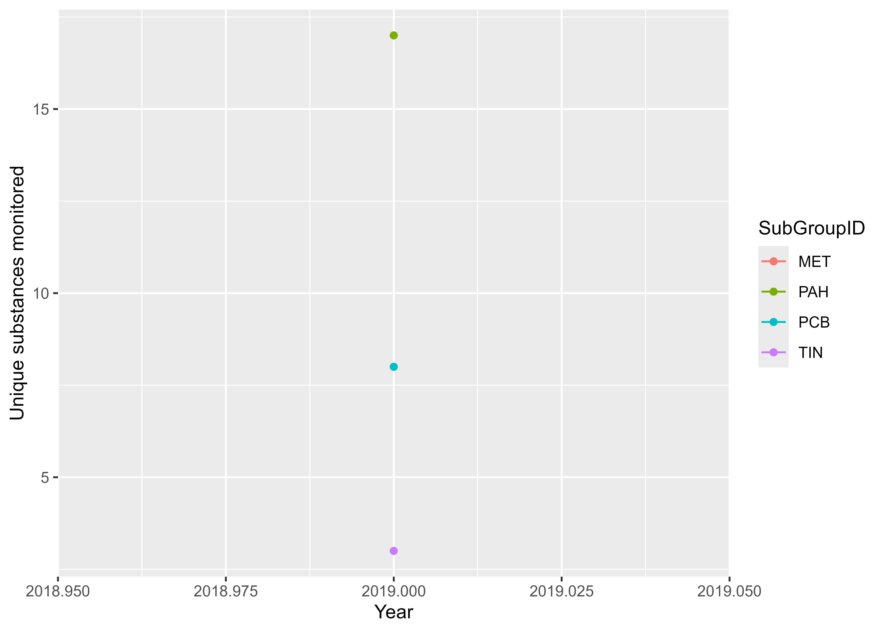](https://sawelch-niva.github.io/Vm2eData/articles/vannmiljo-expect-data_files/figure-html/substances-per-year-basisovervaking-pavirka-omrader-1.png)

### Feltspesifikk miljøovervåking på norsk sokkel

- Ignoring.

n = 308.

Code

``` r

plot_grid_density(
  all_data_reproj_sf_xy |>
    filter(Aktivitet_navn == "Feltspesifikk miljøovervåking på norsk sokkel"),
  "Sediment saltvann",
  "viridis",
  "Feltspesifikk miljøovervåking på norsk sokkel"
)
```

[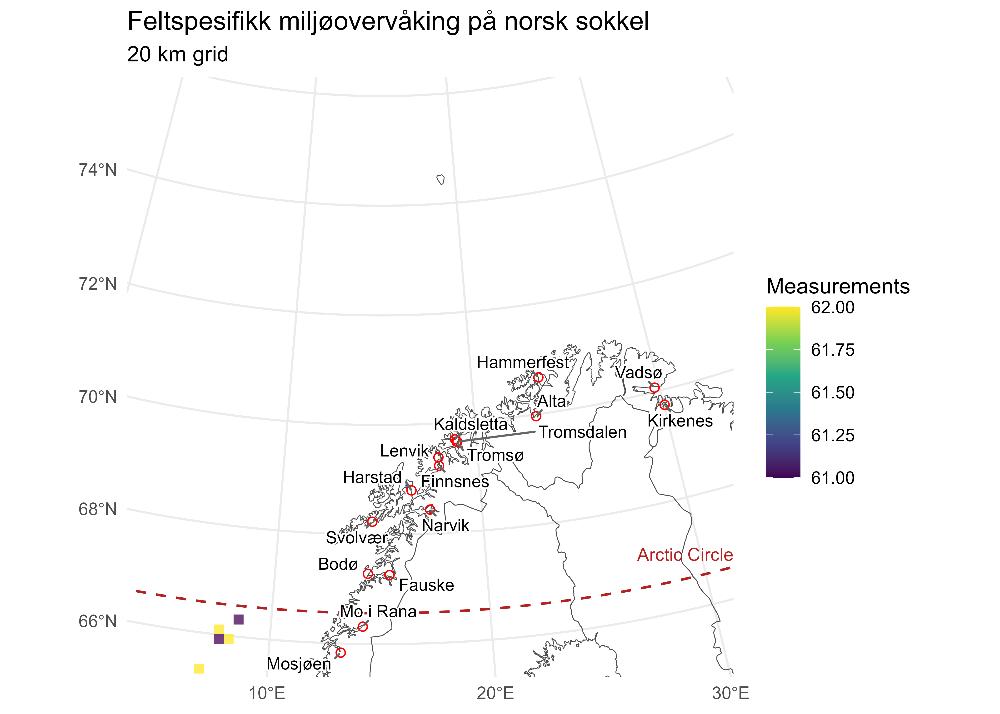](https://sawelch-niva.github.io/Vm2eData/articles/vannmiljo-expect-data_files/figure-html/map-feltspesifikk-miljoovervaking-pa-norsk-sokkel-1.png)

No records above the Arctic Circle for this activity, so there is no
pollutant heatmap.

### Kartlegging av nye miljøgifter

- Ignoring

n = 148.

Code

``` r

plot_grid_density(
  all_data_reproj_sf_xy |>
    filter(Aktivitet_navn == "Kartlegging av nye miljøgifter"),
  "Sediment saltvann",
  "viridis",
  "Kartlegging av nye miljøgifter"
)
```

[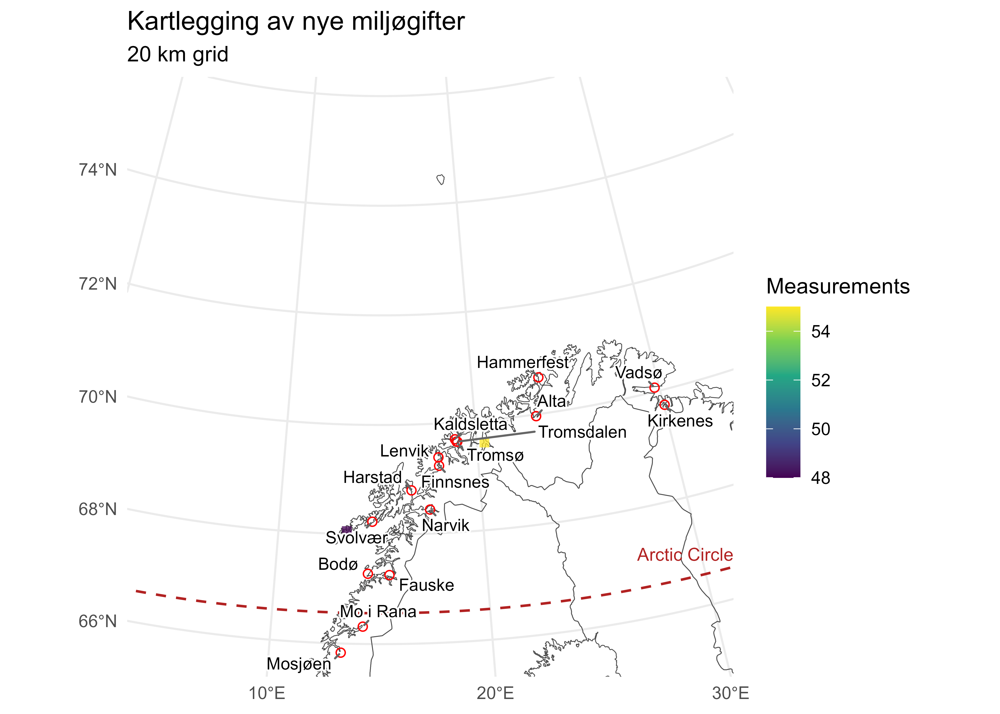](https://sawelch-niva.github.io/Vm2eData/articles/vannmiljo-expect-data_files/figure-html/map-kartlegging-av-nye-miljogifter-1.png)

Code

``` r

all_data_reproj_sf_xy |>
  filter(arctic, Aktivitet_navn == "Kartlegging av nye miljøgifter") |>
  group_by(Medium_navn, Parameter_navn) |>
  reframe(n = n()) |>
  left_join(pollutants, by = join_by(Parameter_navn == Name)) |>
  ggplot(mapping = aes(y = Parameter_navn, x = Medium_navn, fill = n)) +
  geom_tile() +
  scale_fill_viridis_c() +
  facet_grid(rows = vars(SubGroupID), scales = "free", space = "free")
```

[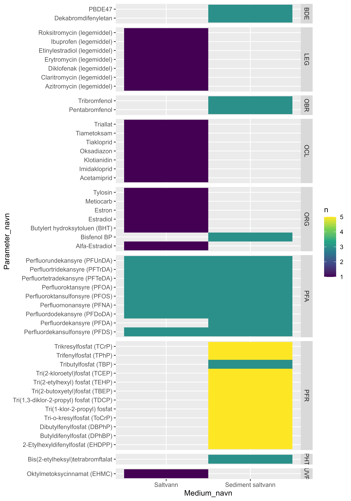](https://sawelch-niva.github.io/Vm2eData/articles/vannmiljo-expect-data_files/figure-html/heatmap-kartlegging-av-nye-miljogifter-1.png)

#### Substances monitored per year

Code

``` r

plot_substances_per_year("Kartlegging av nye miljøgifter")
```

[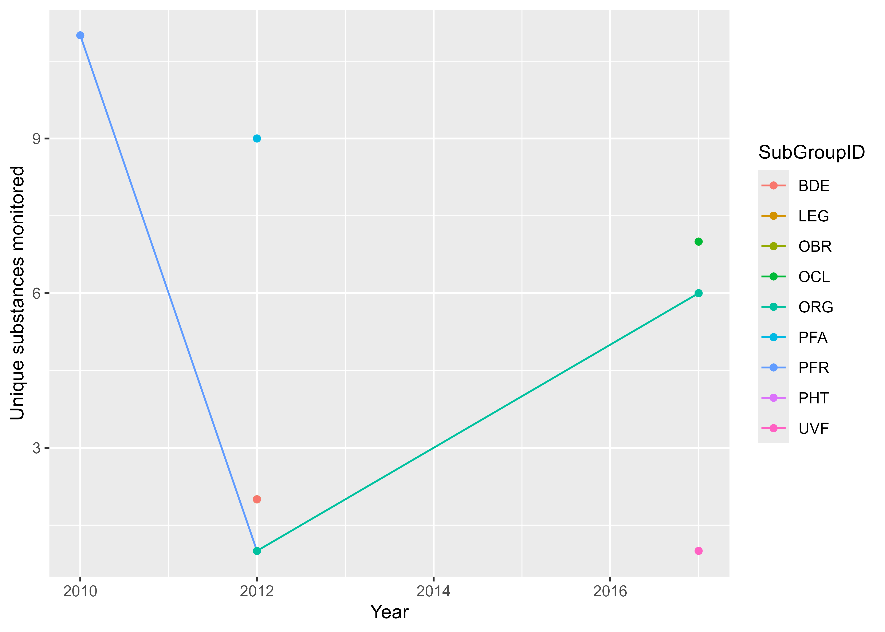](https://sawelch-niva.github.io/Vm2eData/articles/vannmiljo-expect-data_files/figure-html/substances-per-year-kartlegging-av-nye-miljogifter-1.png)

### Watch List

n = 147.

- According to Vm’s website this is a single point (03.63-85476) near
  Bodø
- I don’t know why it doesn’t appear on the map
- This is a very small sample size, but could be a useful source of
  organic/medical substances, if that’s a good angle to take (these are
  watchlist substances, which means they’re more interesting)

Code

``` r

plot_grid_density(
  all_data_reproj_sf_xy |> filter(Aktivitet_navn == "Watch List"),
  "Sediment saltvann",
  "viridis",
  "Watch List"
)
```

[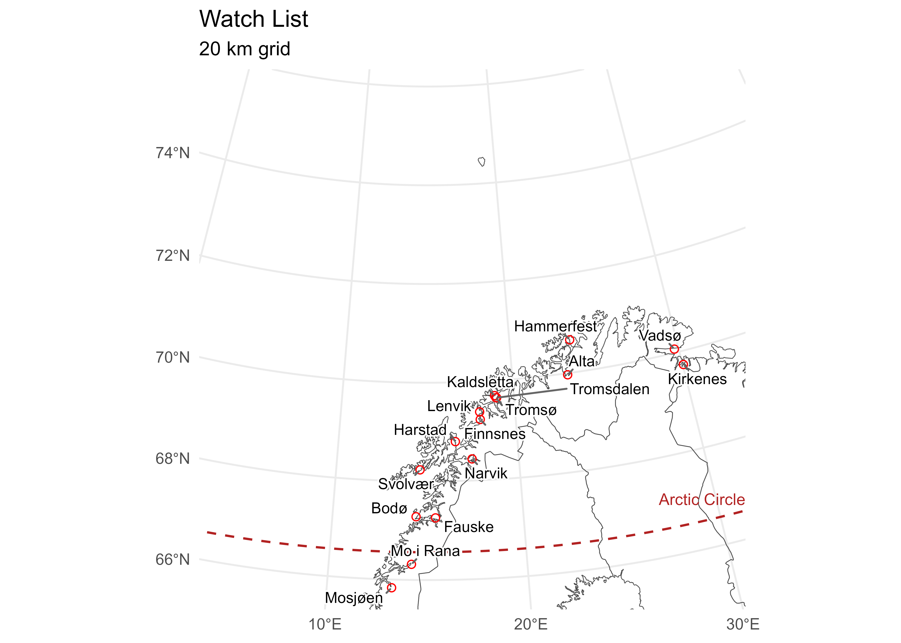](https://sawelch-niva.github.io/Vm2eData/articles/vannmiljo-expect-data_files/figure-html/map-watch-list-1.png)

Code

``` r

all_data_reproj_sf_xy |>
  filter(arctic, Aktivitet_navn == "Watch List") |>
  group_by(Medium_navn, Parameter_navn) |>
  reframe(n = n()) |>
  left_join(pollutants, by = join_by(Parameter_navn == Name)) |>
  ggplot(mapping = aes(y = Parameter_navn, x = Medium_navn, fill = n)) +
  geom_tile() +
  scale_fill_viridis_c() +
  facet_grid(rows = vars(SubGroupID), scales = "free", space = "free")
```

[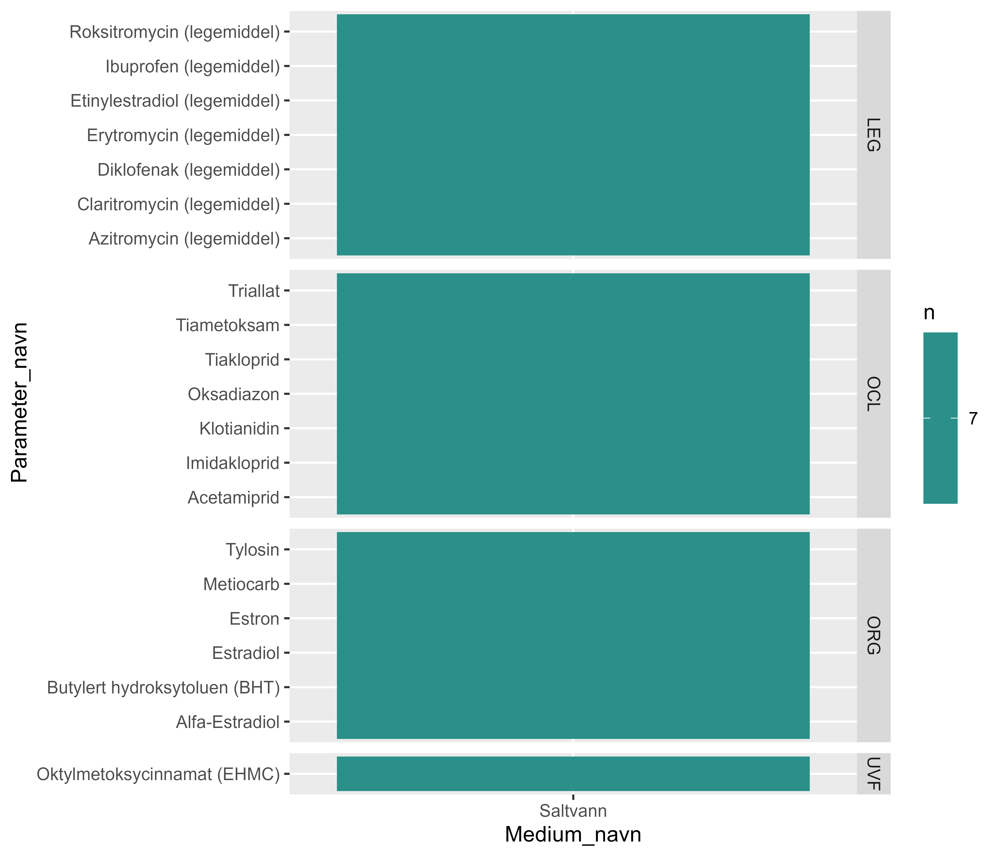](https://sawelch-niva.github.io/Vm2eData/articles/vannmiljo-expect-data_files/figure-html/heatmap-watch-list-1.png)

#### Substances monitored per year

Code

``` r

plot_substances_per_year("Watch List")
```

[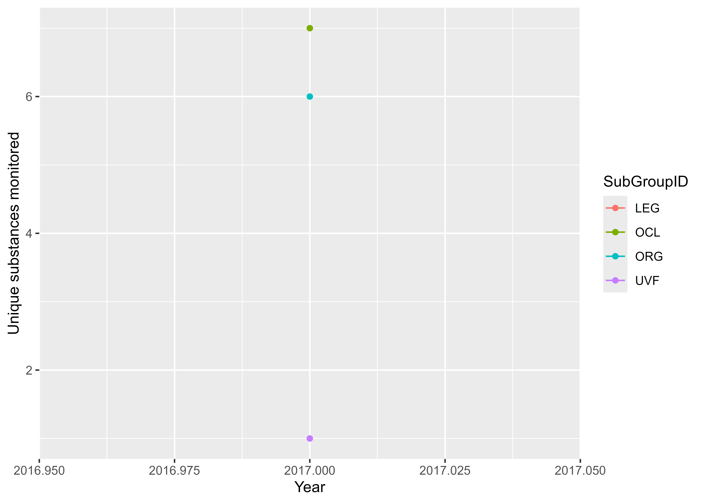](https://sawelch-niva.github.io/Vm2eData/articles/vannmiljo-expect-data_files/figure-html/substances-per-year-watch-list-1.png)

Code

``` r

plot_grid_density(
  all_data_reproj_sf_xy |>
    filter(Aktivitet_navn == "Overvåking av forurenset sjøbunn"),
  "Sediment saltvann",
  "viridis",
  "Overvåking av forurenset sjøbunn"
)
```

[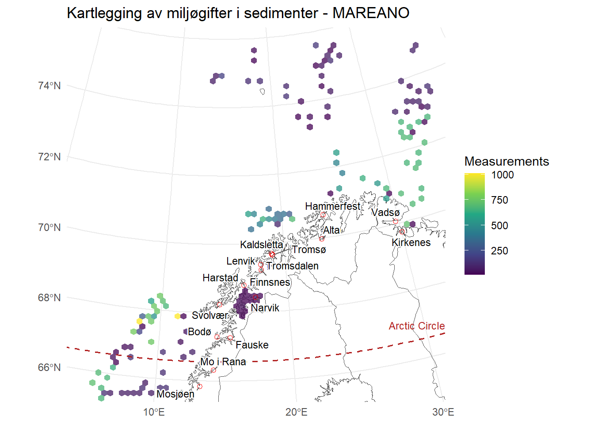](https://sawelch-niva.github.io/Vm2eData/articles/vannmiljo-expect-data_files/figure-html/unnamed-chunk-11-1.png)

Code

``` r

# Arctic coastal water bodies (see data-raw/prepare_vannforekomster.R)
water_bodies <- read_sf(
  here("inst", "shapefiles", "vannforekomster_kyst_arctic.gpkg")
) |>
  st_transform(map_crs) |>
  select(navn, vannforekomst_id)

# Collapse the names of the water bodies a cell overlaps into one string,
# e.g. "Vestfjorden, Skjerstadfjorden (+2 more)"
summarise_overlaps <- function(idx, max_names = 3) {
  nms <- unique(water_bodies$navn[idx])
  if (length(nms) == 0) {
    return("none")
  }
  shown <- paste(head(nms, max_names), collapse = ", ")
  if (length(nms) > max_names) {
    shown <- paste0(shown, " (+", length(nms) - max_names, " more)")
  }
  shown
}

cell_table <- function(data, top_n = 15) {
  # uses the global cell_size, as the maps do
  cells <- data |>
    st_drop_geometry() |>
    mutate(
      cell_x = floor(x / cell_size) * cell_size,
      cell_y = floor(y / cell_size) * cell_size
    ) |>
    summarise(
      measurements = n(),
      stressors = n_distinct(Parameter_navn),
      sites = n_distinct(Vannlokalitet_kode),
      .by = c(cell_x, cell_y)
    ) |>
    slice_max(measurements, n = top_n)

  # cell centres (for nearest city) and square cell polygons (for water bodies)
  centres <- st_as_sf(
    mutate(cells, cx = cell_x + cell_size / 2, cy = cell_y + cell_size / 2),
    coords = c("cx", "cy"),
    crs = map_crs
  )
  cell_polygons <- st_buffer(
    centres,
    dist = cell_size / 2,
    endCapStyle = "SQUARE"
  )

  nearest <- st_nearest_feature(centres, norway_cities)
  overlaps <- st_intersects(cell_polygons, water_bodies)

  cells |>
    mutate(
      nearest_city = norway_cities$city[nearest],
      km_to_city = round(
        as.numeric(
          st_distance(centres, norway_cities[nearest, ], by_element = TRUE)
        ) /
          1000
      ),
      water_bodies = vapply(overlaps, summarise_overlaps, character(1)),
      per_site = round(measurements / sites, 1),
      share = scales::percent(measurements / nrow(data), accuracy = 0.1)
    ) |>
    select(
      nearest_city,
      km_to_city,
      water_bodies,
      measurements,
      sites,
      per_site,
      share
    )
}

all_data_reproj_sf_xy |>
  filter(
    Medium_navn == "Sediment saltvann",
    Aktivitet_navn == "Overvåking av forurenset sjøbunn"
  ) |>
  cell_table() |>
  knitr::kable()
```

| nearest_city | km_to_city | water_bodies | measurements | sites | per_site | share |
|:---|---:|:---|---:|---:|---:|:---|
| Harstad | 9 | Bergsvågen, Astafjorden, Stangnes (+6 more) | 8504 | 245 | 34.7 | 17.3% |
| Tromsø | 4 | Balsfjorden, Kaldfjorden- ytre midtre, Kaldfjorden- indre midtre (+15 more) | 6851 | 96 | 71.4 | 13.9% |
| Bodø | 8 | Saltfjorden-ytre, Landegodefjorden, Helligvær - ytterside Landegode (+3 more) | 6522 | 163 | 40.0 | 13.3% |
| Harstad | 58 | Andenes - Midt Andfjorden, Midt Andfjorden - Kasodden, Andfjorden - Vest (+3 more) | 2160 | 54 | 40.0 | 4.4% |
| Hammerfest | 12 | Rypklubben, Sørøysundet, Revsbotn-ytre (+9 more) | 1528 | 34 | 44.9 | 3.1% |
| Hammerfest | 12 | Revsbotn-ytre, Kvalfjorden, Hammerfest Havn (+2 more) | 1413 | 30 | 47.1 | 2.9% |
| Vadsø | 59 | Blodskytodden - Vardø fyr, Makkaur - Blodskytodden, Vardø fyr - Kibergneset (+4 more) | 1089 | 30 | 36.3 | 2.2% |
| Vadsø | 126 | Kifjorden, Oksefjorden, Laksefjorden-ytre (+4 more) | 972 | 31 | 31.4 | 2.0% |
| Hammerfest | 56 | Fruholmen fyr - Hjelmsøya, Rolvsøysundet, Masøyfjorden-nord (+9 more) | 918 | 26 | 35.3 | 1.9% |
| Harstad | 36 | Andfjorden - Vest, Gavlfjorden, Tranesvågen (+6 more) | 900 | 25 | 36.0 | 1.8% |
| Tromsdalen | 80 | Kvænangen - Ytre, Fugløyfjorden, Lauksundet (+3 more) | 894 | 24 | 37.2 | 1.8% |
| Hammerfest | 85 | Honningsvåg havn, Even Hansen bukta, Lafjorden (+10 more) | 870 | 28 | 31.1 | 1.8% |
| Vadsø | 123 | Vevikneset, Mehamnsfjorden, Kinnarodden - Vardnesodden (+7 more) | 855 | 28 | 30.5 | 1.7% |
| Svolvær | 55 | Moskenes - Flakstad, Vestfjorden-midtre, Ramberg havn (+17 more) | 803 | 26 | 30.9 | 1.6% |
| Vadsø | 10 | Varangerfjorden-indre Finnmark, Varangerfjorden-ytre nordside, Vadsø havn øst (+2 more) | 756 | 21 | 36.0 | 1.5% |
