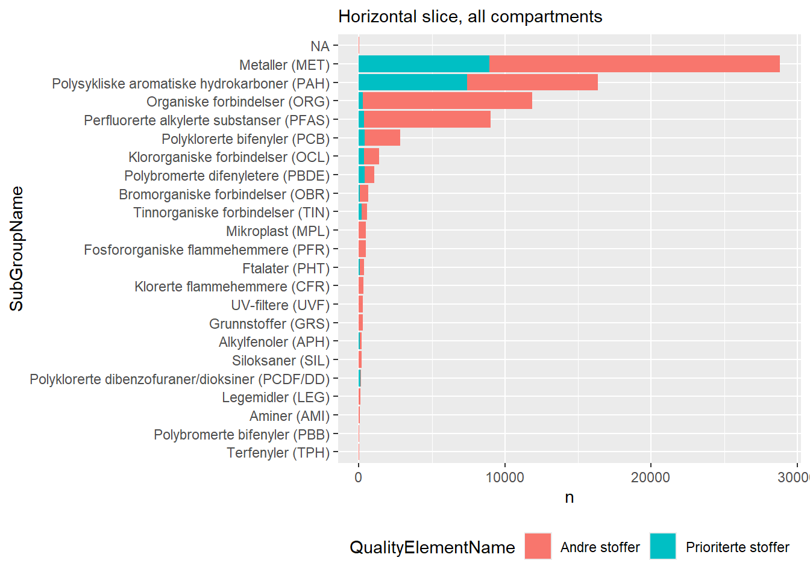
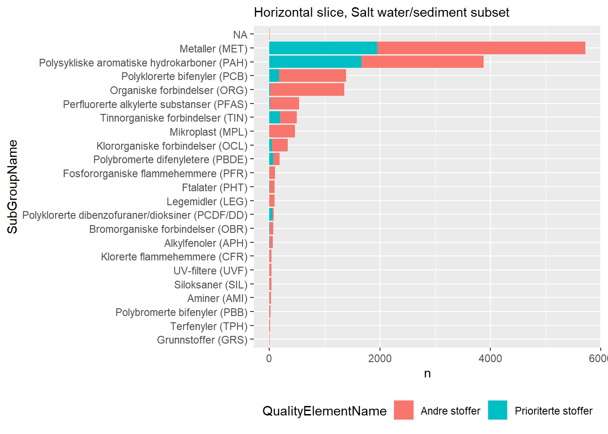
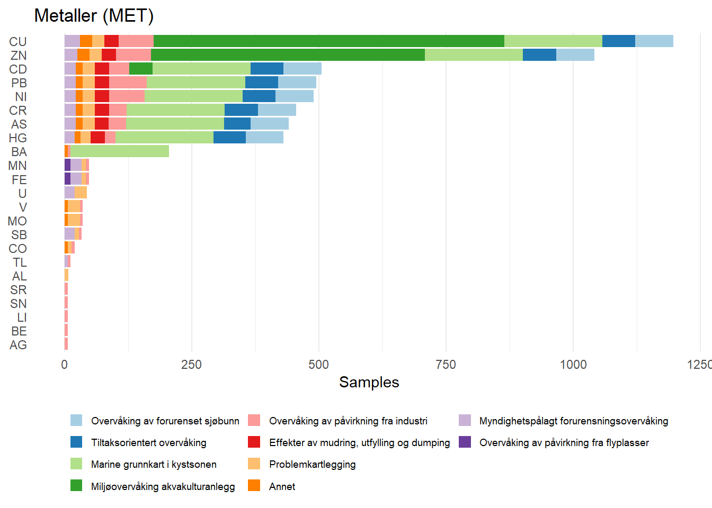
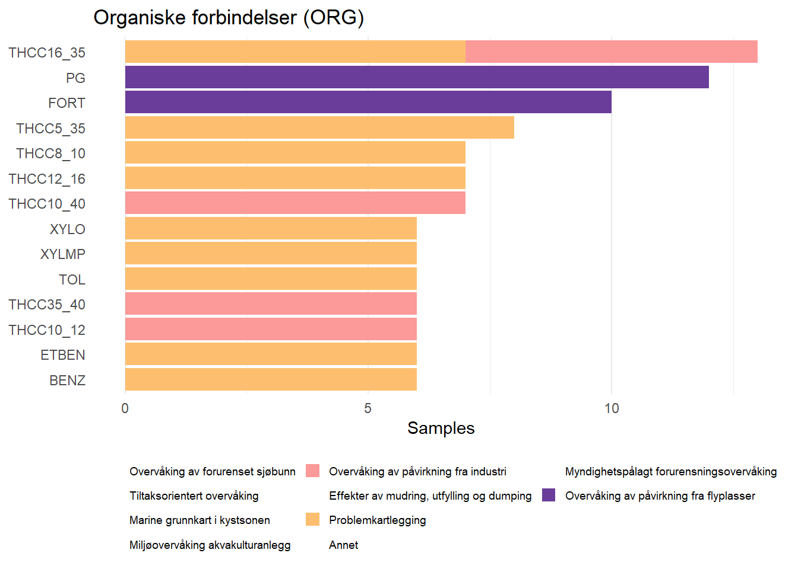
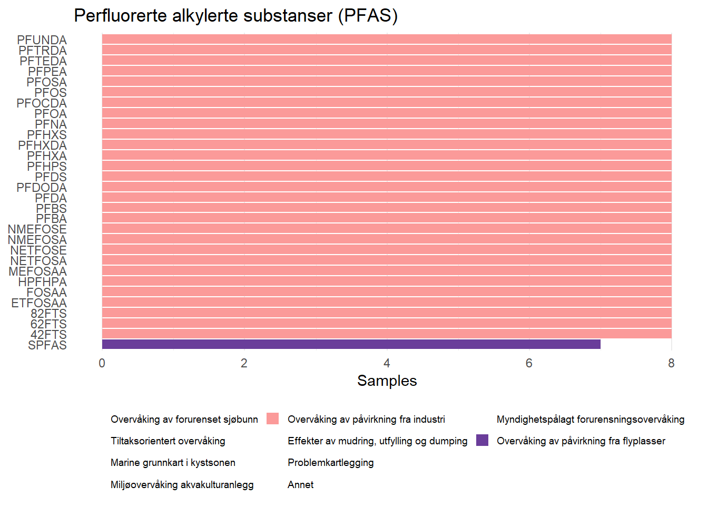
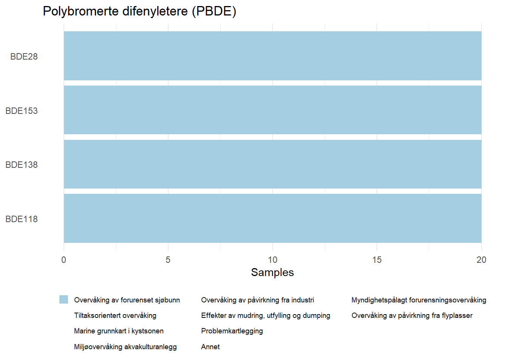
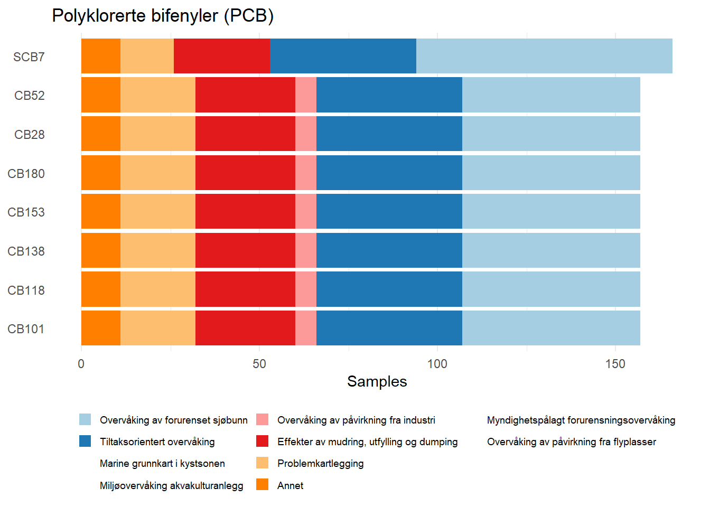
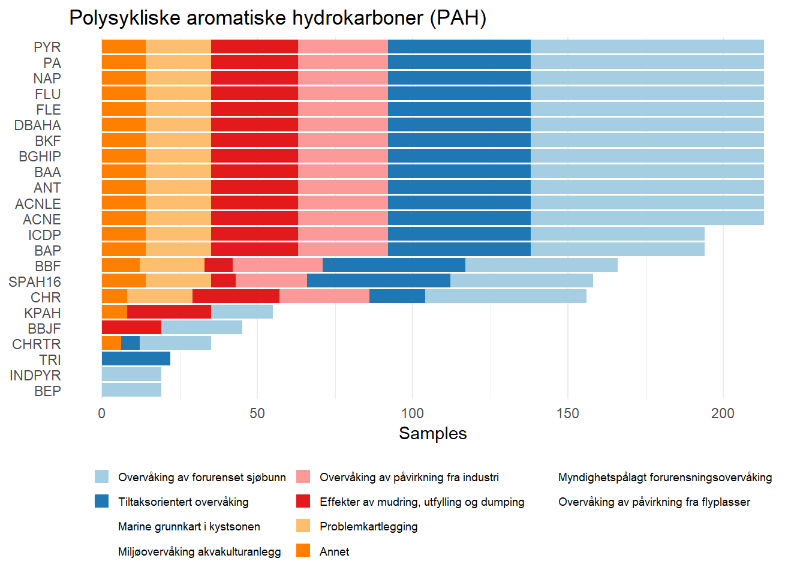
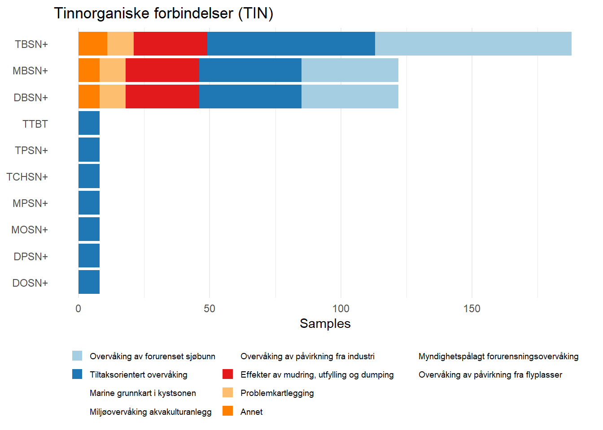

# Vannmiljø Pollutants - Arctic & Marine

I’ve split some of the pollutant-specific exploration out to here, so it
gets its own file.

Vannmiljø identifies four types of parameters in their data:

- Biologiske kvalitetselementer
- Fysisk-kjemiske kvalitetselementer
- Hydromorfologiske kvalitetselementer
- Spesifikke forurensende stoffer (miljøgifter)

As a rule, we are uninterested in the first three.

## Pollutants Table

We can download a table of all the parameters considered pollutants from
Vannmiljø’s [code list
site](https://vannmiljokoder.miljodirektoratet.no/parameter/sfs).

Code

``` r

pollutants <- read_excel(
  here("data", "raw", "vannmiljo", "Vannmiljø_Miljøgifter_2026-09-29.xlsx")
)

parameters <- unique(pollutants$Name)
```

> **Norwegian Environmental Agency comments on pollutants data**
>
> > Spesifikke forurensende stoffer omfatter et bredt spekter av
> > organiske miljøgifter og tungmetaller. De er inndelt i «prioriterte
> > stoffer» og «andre stoffer». De prioriterte stoffene omfatter 45
> > stoffer eller stoffgrupper (jf. EU-direktiv 2013/39/EU). Det er
> > utarbeidet miljøkvalitetsstandarder (EQS) for disse stoffene, som
> > danner utgangspunkt for klassifisering av kjemisk tilstand.
> > Miljøgiftene gruppert under «andre stoffer» utgjør støtteparametre
> > for klassifisering av økologisk tilstand i den grad det er
> > utarbeidet EQS for disse.
>
> *Machine Translation:* Specific pollutants cover a broad range of
> organic contaminants and heavy metals. They are divided into “priority
> substances” and “other substances”. The priority substances comprise
> 45 substances or groups of substances (cf. EU Directive 2013/39/EU).
> Environmental quality standards (EQS) have been developed for these
> substances, and form the basis for classifying chemical status. The
> contaminants grouped under “other substances” serve as supporting
> parameters for classifying ecological status, to the extent that EQS
> have been developed for them.
>
> > NB! For tungmetallene er EQS basert på løste fraksjoner (ikke
> > partikulært bundet). Dersom tungmetallene skal klassifiseres må de
> > analyseres på filtrerte prøver.
>
> *Machine Translation:* *Note!* For heavy metals, the EQS are based on
> dissolved fractions (not particle-bound). If heavy metals are to be
> classified, they must be analysed on filtered samples.
>
> > For å gjøre søk på miljøgiftene lettere i kodeverket er både
> > prioriterte og andre stoffer gruppert i stoffgrupper etter kjemisk
> > sammensetning og egenskaper (PAH, PCB osv.) så langt det lar seg
> > gjøre.
>
> *Machine Translation:* To make searching for contaminants in the code
> list easier, both priority and other substances are grouped into
> substance groups by chemical composition and properties (PAH, PCB,
> etc.) as far as possible.
>
> > Parameterkodene for spesifikke forurensende stoffer følger i det alt
> > vesentlige systematikken til det internasjonale havforskningsrådet
> > (ICES), se ICES Reference Codes (RECO). Der ICES ikke har definert
> > noen kode er det laget nye koder. Disse er i stor grad basert på
> > godt innarbeidede forkortelser på kjemiske stoffer eller lagt så
> > nært opp til ICES systematikk som mulig.
>
> *Machine Translation:* The parameter codes for specific pollutants
> largely follow the system of the International Council for the
> Exploration of the Sea (ICES); see the ICES Reference Codes (RECO).
> Where ICES has not defined a code, new codes have been created. These
> are largely based on well-established abbreviations of chemical
> substances, or kept as close to the ICES system as possible.
>
> > Nedenfor finner du eksempler på ferdig utfylte importskjema for
> > utvalgte kvalitetselementer. Legg merke til at det er obligatorisk å
> > oppgi prøvenummer (en fritt valgt kode) dersom registreringene
> > gjelder enkeltindivider av f.eks. fisk eller skalldyr. På den måten
> > vet man hvilke stoffkonsentrasjoner som tilhører ett og samme
> > individ. Dessuten vil man unngå mistanke om duplikate registreringer
> > dersom det er registrert samme verdi for et stoff i flere individer
> > på samme prøvetakingstidspunkt. Tilsvarende er det også obligatorisk
> > å oppgi prøvenummer for registrering av bunndyr i marine sedimenter
> > (bløtbunnundersøkelser) for å skille mellom parallelle grabbprøver.
>
> *Machine Translation:* Below you will find examples of completed
> import forms for selected quality elements. Note that it is mandatory
> to provide a sample number (a freely chosen code) when the
> registrations concern individual specimens of, e.g., fish or
> shellfish. That way, it is clear which substance concentrations belong
> to one and the same individual. It also avoids suspicion of duplicate
> registrations if the same value has been recorded for a substance in
> several individuals at the same sampling time. Similarly, it is
> mandatory to provide a sample number when registering benthic fauna in
> marine sediments (soft-bottom surveys), to distinguish between
> parallel grab samples.

Let’s take a quick look at the table:

Code

``` r

glimpse(pollutants)
```

    Rows: 2,716
    Columns: 12
    $ ParameterID          <chr> "HXCCPD", "TCMOB135", "CDFM", "DCBPO24", "BTBPTMC…
    $ Name                 <chr> "Heksaklorsyklopentadien", "2,4,6-trikloranisol",…
    $ Description          <chr> "1,2,3,4,5,5-heksaklorsyklopenta-1,3-dien_x000d_\…
    $ CASnr                <chr> "77-47-4", "87-40-1", "75-45-6", "133-14-2", "673…
    $ QualityElementTypeID <chr> "SFS", "SFS", "SFS", "SFS", "SFS", "SFS", "SFS", …
    $ QualityElementID     <chr> "AST", "AST", "AST", "AST", "AST", "AST", "AST", …
    $ QualityElementName   <chr> "Andre stoffer", "Andre stoffer", "Andre stoffer"…
    $ SubGroupID           <chr> "OCL", "OCL", "OCL", "OCL", "ORG", "ORG", "PHT", …
    $ SubGroupName         <chr> "Klororganiske forbindelser (OCL)", "Klororganisk…
    $ ParameterID_VannNett <chr> NA, NA, NA, NA, NA, NA, NA, NA, NA, NA, NA, NA, N…
    $ ParameterID_WISE     <chr> NA, NA, NA, NA, NA, NA, NA, NA, NA, NA, NA, NA, N…
    $ Prioritized          <chr> NA, NA, NA, NA, NA, NA, NA, NA, NA, NA, NA, NA, N…

So, we can see that this table already comes with some pretty useful
metadata. We have priority substances, CAS codes, long names, short
names, a system of mutually exclusive categories, and possibly some
other IDs for other databases (e.g. WISE, VannNett).

### Chemical Pollutant Subgroups

Let’s look at chemical pollutant subgroups first - this is likely to
give us the most useful insight into the structure of the data.

`SubGroupName` splits substances as follows:

Code

``` r

set.seed(123)

pollutants |>
  group_by(SubGroupName, SubGroupID) |>
  reframe(
    n = n(),
    example = str_flatten_comma(sample(Name, size = 3))
  ) |>
  arrange(desc(n)) |>
  kable()
```

| SubGroupName | SubGroupID | n | example |
|:---|:---|---:|:---|
| Organiske forbindelser (ORG) | ORG | 984 | Oleinsyredietanolamid, 1,1’-(klorfenylmetylen)bis\[4-metoksybenzen\], 1,2-difluor-4-\[4-\[2-(4-propylsykloheksyl)etyl\]sykloheksyl\]benzen |
| Mikroplast (MPL) | MPL | 460 | Antall naturgummibaserte fragmenter \>1 mm, Antall polyfluorerte polymere fragmenter \>1 mm, Antall etylen-vinylacetatbaserte fibre 300 µm - 1 mm |
| Klororganiske forbindelser (OCL) | OCL | 271 | Kvinmerac, Heksaklorfenylbisykloheptadien, Fenoprop |
| Perfluorerte alkylerte substanser (PFAS) | PFA | 174 | Perfluor-2,5,8,10-tetrametyl-3,6,9-trioksaundekansyre (4x3-PFECA), 8:2 diPAP, Sum PFAS (EFSA 4) |
| Polysykliske aromatiske hydrokarboner (PAH) | PAH | 125 | C3-Fenantrener/antracener, 2-hydroksynaftalen, 2,6-dimetylnaftalen |
| Legemidler (LEG) | LEG | 92 | Haloperidol (legemiddel), Ibuprofen (legemiddel), Orfenadrin (legemiddel) |
| Metaller (MET) | MET | 86 | Aluminium, Antimon, Krom (VI) |
| Polyklorerte bifenyler (PCB) | PCB | 86 | OH-PCB107, OH-PCB146, PCB33 |
| Bromorganiske forbindelser (OBR) | OBR | 66 | Pentabrombenzen, Brommetan, 1-brom-4-(tribrommetyl)benzen |
| Polybromerte difenyletere (PBDE) | BDE | 50 | PBDE183, PBDE47, PBDE49+71 |
| Alkylfenoler (APH) | APH | 47 | 4-n-Oktylfenol, 3-etylfenol, 2-etylfenol |
| Ftalater (PHT) | PHT | 47 | (2-ethylheksyl)hydrogenftalate, Monobutylftalate, Dinonylftalat |
| Polyklorerte dibenzofuraner/dioksiner (PCDF/DD) | PDX | 41 | Sum PCDF, HpCDF (F134), 1,2,3,6,8/1,3,4,7,9-PeCDF |
| Siloksaner (SIL) | SIL | 31 | F-D4a, Tetradekametylsykloheptasiloksan (D7), Dokosametyldekasiloxan (L10) |
| UV-filtere (UVF) | UVF | 31 | 4-Metylbenzylidenkamfor, 2-(4-metoksy-2,2,6,6-tetrametylpiperidin-1-yl)etyl 4-oksopentanoat (Tinuvin 622), (E)-EHMC |
| Aminer (AMI) | AMI | 29 | N-Nitrosodiisononylamin, N-Nitrosodipropylamin dannende stoffer, N-nitrosopiperazin |
| Fosfororganiske flammehemmere (PFR) | PFR | 25 | Sum TBP og TIBP, Tri(1,3-diklor-2-propyl) fosfat (TDCP), Tri-m-kresylfosfat (TmCrP) |
| Polybromerte bifenyler (PBB) | PBB | 19 | PBB209, PBB153, PBB101 |
| Klorerte flammehemmere (CFR) | CFR | 15 | 1,2,3,4,7,7-Heksaklor-5-(2,4,6-tribromfenyl)bisyklo\[2.2.1\]hept-2-en, 1,2,3,4,7,7-Heksaklor-5-fenylbisyklo\[2.2.1\]hept-2-en, Dekloran 604 |
| Tinnorganiske forbindelser (TIN) | TIN | 15 | Dioktyltinndiklorid, Trioktyltinnklorid, Trifenyltinn kation (TPhT) |
| Terfenyler (TPH) | TPH | 12 | m-terfenyl, cis-1,3-difenylsykloheksan, 1,4-disyckoheksylbenzen |
| Grunnstoffer (GRS) | GRS | 7 | Dibrom, Jod-131, Selen |
| NA | NA | 3 | DagTest, DagTest, DagTest |

This is a lot of groups, and each group has a lot of members. There’s no
obvious group to pick on as the most relevant. We can take a quick look
at the prioritised members of each group:

Code

``` r

pollutants |>
  filter(QualityElementName == "Prioriterte stoffer") |>
  group_by(SubGroupName) |>
  reframe(priority_substances = str_flatten_comma(Name)) |>
  kable()
```

| SubGroupName | priority_substances |
|:---|:---|
| Alkylfenoler (APH) | 4-n-Nonylfenol, 4-tert-Oktylfenol, 4-iso-Nonylfenol |
| Bromorganiske forbindelser (OBR) | Sum Heksbromsyklododekan (HBCDD), 1,3,5,7,9,11-HBCDD, 1,2,5,6,9,10-HBCDD, a-HBCDD, b-HBCDD, g-HBCDD |
| Ftalater (PHT) | Bis(2-etylheksyl)ftalat |
| Klororganiske forbindelser (OCL) | Pentaklorbenzen, Kortkjedete klorparafiner (C10-13), Sum DDT, Triklormetan, 1,1,2,2-Tetrakloreten, Sum triklorbenzener (alle isomere), 1,1,2-Trikloreten, Karbontetraklorid, Klorfenvinfos, Klorpyrifos, 1,2-dikloretan, Diklormetan, Diuron, pp’-DDT, Dicofol, Dieldrin, Endrin, Endosulfan, Heksaklorbenzen, Heksaklorbutadien, Sum HCH (må spesifiseres), Isodrin, Pentaklorfenol, Alaklor, Aldrin, Heptaklor, Heptaklorepoksid, Quinoxyfen, Aklonifen, Bifenox, Diklorvos |
| Metaller (MET) | Kadmium, Kvikksølv, Nikkel, Bly |
| Organiske forbindelser (ORG) | Simazin, Trifluralin, Isoproturon, Irgarol, Atrazin, Benzen, Terbutryn, Cypermetrin, alfa-Cypermetrin, Alfametrin, 8-\[4-(4-metylfenyl-)-3-sykloheksen1-yl\]-1,4-Dioksaspiro\[4.5\]decan |
| Perfluorerte alkylerte substanser (PFAS) | Perfluoroktansulfonsyre (PFOS) |
| Polybromerte difenyletere (PBDE) | PBDE100, PBDE153, PBDE154, PBDE28, PBDE47, PBDE99, Sum PBDE6, Sum HeptaBDE, Sum TetraBDE, Sum HeksaBDE |
| Polyklorerte bifenyler (PCB) | PCB126, PCB156, PCB169, PCB77, PCB105, PCB118, PCB81, PCB114, PCB123, PCB157, PCB167, PCB189 |
| Polyklorerte dibenzofuraner/dioksiner (PCDF/DD) | TCDD (D48), PeCDD (D54), HxCDD (D66), HpCDD (D73), HxCDD (D67), HxCDD (D70), OCDD (D75), PeCDF (F114), TCDF (F83), HxCDF (F130), HpCDF (F131), HxCDF (F121), HpCDF (F134), HxCDF (F124), OCDF (F135), PeCDF (F94), HxCDF (F118), Sum dioksiner-TEQ (PCDD + PCDF) og dioksinlignende stoffer-TEQ (PCB-DL) |
| Polysykliske aromatiske hydrokarboner (PAH) | Fluoranten, Indeno\[1,2,3-cd\]pyren, Naftalen, Antracen, Benzo\[a\]pyren, Benzo\[b\]fluoranten, Benzo\[ghi\]perylen, Benzo\[k\]fluoranten |
| Tinnorganiske forbindelser (TIN) | Tributyltinn kation (TBT) |

To be honest, I don’t know enough about monitoring campaigns to make a
good judgement about this data. The pesticides (under OCL), PCBs, PAHs,
and heavy metals look right to me. I don’t know whether these substances
are prioritised at the EU level or more locally (national or e.g. river
basin).

## Horizontal Slice

To gain a deeper understanding about the patterns of pollutants in
Vannmiljø, we need to work with actual measurements.

Let’s start with a horizontal slice of Vannmiljø, hopefully more-or-less
representative. This is all the data from 01 January 2020 to 31 May
2020, which is 464,059 rows. This is downloaded from
`Søk i vannrelaterte data`, so we can expect not only pollutants
(chemicals, microplastics, etc.), but also biological quality
parameters,

Code

``` r

horizontal_slice <- read_parquet(here(
  "inst",
  "example_datasets",
  "registrations",
  "WaterRegistrationExport-NO-Jan20-May20.parquet"
))
```

Code

``` r

pollutant_representation <- right_join(
  horizontal_slice,
  pollutants,
  by = join_by(Parameter_id == ParameterID)
)

glimpse(pollutant_representation)
```

    Rows: 75,320
    Columns: 48
    $ Vannlokalitet_kode    <chr> "053-27554", "053-27554", "053-27554", "053-2755…
    $ Vannlokalitetsnavn    <chr> "Gjønavatnet", "Gjønavatnet", "Gjønavatnet", "Gj…
    $ Betegnelse            <chr> NA, NA, NA, NA, NA, NA, NA, NA, NA, NA, NA, NA, …
    $ Type                  <chr> "Innsjø", "Innsjø", "Innsjø", "Innsjø", "Innsjø"…
    $ Aktivitet_id          <chr> "TILT", "TILT", "TILT", "TILT", "TILT", "TILT", …
    $ Aktivitet_navn        <chr> "Tiltaksorientert overvåking", "Tiltaksorientert…
    $ Oppdragsgiver         <chr> "Oppdrettere", "Oppdrettere", "Oppdrettere", "Op…
    $ Oppdragstaker         <chr> "Rådgivende Biologer AS", "Rådgivende Biologer A…
    $ Parameter_id          <chr> "CD", "CU", "ZN", "FE", "CD", "CU", "ZN", "FE", …
    $ Parameter_navn        <chr> "Kadmium", "Kobber", "Sink", "Jern", "Kadmium", …
    $ Parameter_casnr       <chr> "7440-43-9", "7440-50-8", "7440-66-6", "7439-89-…
    $ Medium_id             <chr> "VF", "VF", "VF", "VF", "VF", "VF", "VF", "VF", …
    $ Medium_navn           <chr> "Ferskvann", "Ferskvann", "Ferskvann", "Ferskvan…
    $ LatinskNavn_id        <dbl> 0, 0, 0, 0, 0, 0, 0, 0, 0, 0, 0, 0, 0, 0, 0, 0, …
    $ VitenskapligNavn      <chr> "Artsuavhengig", "Artsuavhengig", "Artsuavhengig…
    $ Provetakmetode_id     <chr> "NS-ISO 5667-4:2016A", "NS-ISO 5667-4:2016A", "N…
    $ Analysemetode_id      <chr> "NS-EN ISO 17294-2:2016", "NS-EN ISO 17294-2:201…
    $ Tid_provetak          <chr> "2020-04-22 00:00:00", "2020-04-22 00:00:00", "2…
    $ Ovre_dyp              <dbl> 0, 0, 0, 0, 0, 0, 0, 0, 0, 0, 0, 0, 0, 0, 0, 0, …
    $ Nedre_dyp             <dbl> 5, 5, 5, 5, 5, 5, 5, 5, 5, 5, 5, 5, 5, 5, 5, 5, …
    $ DybdeEnhet            <chr> "m", "m", "m", "m", "m", "m", "m", "m", "m", "m"…
    $ Filtrert_Prove        <chr> "Ufiltrert", "Ufiltrert", "Ufiltrert", "Ufiltrer…
    $ UnntasKlassifisering  <lgl> NA, NA, NA, NA, NA, NA, NA, NA, NA, NA, NA, NA, …
    $ Operator              <chr> "=", "=", "=", "=", "=", "=", "=", "=", "=", "="…
    $ Verdi                 <dbl> 0.009, 0.160, 1.200, 12.000, 0.011, 0.170, 1.300…
    $ Listenavn             <lgl> NA, NA, NA, NA, NA, NA, NA, NA, NA, NA, NA, NA, …
    $ Enhet                 <chr> "µg/l", "µg/l", "µg/l", "µg/l", "µg/l", "µg/l", …
    $ Provenr               <chr> NA, NA, NA, NA, NA, NA, NA, NA, NA, NA, NA, NA, …
    $ Deteksjonsgrense      <dbl> NA, NA, NA, NA, NA, NA, NA, NA, NA, NA, NA, NA, …
    $ Kvantifiseringsgrense <dbl> NA, NA, NA, NA, NA, NA, NA, NA, NA, NA, NA, NA, …
    $ Opprinnelse           <chr> NA, NA, NA, NA, NA, NA, NA, NA, NA, NA, NA, NA, …
    $ Ant_verdier           <dbl> 1, 1, 1, 1, 1, 1, 1, 1, 1, 1, 1, 1, 1, 1, 1, 1, …
    $ Kommentar             <chr> NA, NA, NA, NA, NA, NA, NA, NA, NA, NA, NA, NA, …
    $ Arkiv                 <chr> "N", "N", "N", "N", "N", "N", "N", "N", "N", "N"…
    $ Produktbeskrivelse    <lgl> NA, NA, NA, NA, NA, NA, NA, NA, NA, NA, NA, NA, …
    $ `UTM33 Ost (X)`       <dbl> -5393.856, -5393.856, -5393.856, -5393.856, -539…
    $ `UTM33 Nord (Y)`      <dbl> 6715392, 6715392, 6715392, 6715392, 6715392, 671…
    $ Name                  <chr> "Kadmium", "Kobber", "Sink", "Jern", "Kadmium", …
    $ Description           <chr> "Kadmium", "Kobber", "Sink", "Jern", "Kadmium", …
    $ CASnr                 <chr> "7440-43-9", "7440-50-8", "7440-66-6", "7439-89-…
    $ QualityElementTypeID  <chr> "SFS", "SFS", "SFS", "SFS", "SFS", "SFS", "SFS",…
    $ QualityElementID      <chr> "PRI", "AST", "AST", "AST", "PRI", "AST", "AST",…
    $ QualityElementName    <chr> "Prioriterte stoffer", "Andre stoffer", "Andre s…
    $ SubGroupID            <chr> "MET", "MET", "MET", "MET", "MET", "MET", "MET",…
    $ SubGroupName          <chr> "Metaller (MET)", "Metaller (MET)", "Metaller (M…
    $ ParameterID_VannNett  <chr> "CAS_7440-43-9", "CAS_7440-50-8", "CAS_7440-66-6…
    $ ParameterID_WISE      <chr> "CAS_7440-43-9", "CAS_7440-50-8", "CAS_7440-66-6…
    $ Prioritized           <chr> "P", NA, NA, NA, "P", NA, NA, NA, NA, NA, NA, NA…

First, most important note. Right-joining to pollutants leaves us with
75,320 rows, less than a quarter of the original data.

Which subgroups are best represented?

Code

``` r

pollutant_rep_per_subgroup <- pollutant_representation |>
  group_by(QualityElementName, SubGroupName, SubGroupID) |>
  reframe(n = n(), n_substances = n_distinct(Parameter_id)) |>
  mutate(
    SubGroupName = fct_reorder(SubGroupName, n, .fun = sum, .na_rm = FALSE)
  )

ggplot(
  pollutant_rep_per_subgroup,
  mapping = aes(y = SubGroupName, x = n, fill = QualityElementName)
) +
  geom_col() +
  labs(subtitle = "Horizontal slice, all compartments") +
  theme(legend.position = "bottom")
```

[](https://sawelch-niva.github.io/Vm2eData/articles/vannmiljo-pollutants_files/figure-html/unnamed-chunk-3-1.png)

Code

``` r

pareto <- pollutant_rep_per_subgroup |>
  mutate(
    is_main_subgroups = SubGroupID %in% c("MET", "PAH", "ORG", "PFAS")
  ) |>
  reframe(sum_n = sum(n), .by = is_main_subgroups)

pull(pareto, sum_n)[2] / (pull(pareto, sum_n)[1] + pull(pareto, sum_n)[2])
```

    [1] 0.756957

So:

- Prioritised substances are overrepresented (which makes a lot of
  sense), but still less than half of total measured data
- Metals, PAHs, organic molecules, and PFAS are by far the most measured
  groups (a little over 75%)

### Pollutants in Salt water and sediment

One key obstacle to using the above data is that we don’t know if what
we’re seeing is a representative sample of the parts of Vannmiljø we’re
interested in - marine water and sediment. So we should subset our slice
and take a closer look.

Code

``` r

horizontal_slice_salt <- horizontal_slice |>
  filter(Medium_id %in% c("VS", "SS"))

nrow(horizontal_slice)
```

    [1] 464059

Code

``` r

nrow(horizontal_slice_salt)
```

    [1] 295430

In doing so, we reduce our slice from 464,059 to 295,430 rows. Then more
or less the same operation as above:

Code

``` r

pollutant_representation_salt <- right_join(
  horizontal_slice_salt,
  pollutants,
  by = join_by(Parameter_id == ParameterID)
)

pollutant_rep_per_subgroup_salt <- pollutant_representation_salt |>
  group_by(QualityElementName, SubGroupName, SubGroupID) |>
  reframe(n = n(), n_substances = n_distinct(Parameter_id)) |>
  mutate(
    SubGroupName = fct_reorder(SubGroupName, n, .fun = sum, .na_rm = FALSE)
  )

ggplot(
  pollutant_rep_per_subgroup_salt,
  mapping = aes(y = SubGroupName, x = n, fill = QualityElementName)
) +
  geom_col() +
  labs(subtitle = "Horizontal slice, Salt water/sediment subset") +
  theme(legend.position = "bottom")
```

[](https://sawelch-niva.github.io/Vm2eData/articles/vannmiljo-pollutants_files/figure-html/unnamed-chunk-6-1.png)

So, in some places the pattern holds. Metals are still the best
represented, and PAH are still in position \#2. Priority substances are
still less than half of all groups. Our x axis goes from a limit of
30,000 to 6,000

Key differences: - ORG drops from \#3 to \#4 - PCBs rises from \#5 to
\#3 - PFAS drops from \#4 to \#5 - Tinorganic molecules rises to \#6

## Individual Stressors

We should look at individual stressors too. Rather than work with too
large a dataset, we’ll continue with the salt (salt water, and salt
water sediment) subset of the horizontal slice.

Code

``` r

salt_pollutant_overview <- pollutant_representation_salt |>
  group_by(
    Parameter_id,
    Parameter_navn,
    SubGroupID,
    SubGroupName,
    Aktivitet_id,
    Aktivitet_navn
  ) |>
  reframe(n = n()) |>
  arrange(desc(n))

top_salt_pollutants <- salt_pollutant_overview |>
  slice_max(order_by = n, prop = 0.1)

# Fix the activity levels (ordered by overall size) and the colour for each, so
# an activity looks the same in every plot, even where it is absent. Levels come
# from the top-10% subset actually plotted, not the full overview (13 values).
activity_levels <- top_salt_pollutants |>
  count(Aktivitet_navn, wt = n, sort = TRUE) |>
  pull(Aktivitet_navn)

activity_colours <- set_names(
  RColorBrewer::brewer.pal(12, "Paired")[seq_along(activity_levels)],
  activity_levels
)

plot_subgroup <- function(data, subgroup) {
  data |>
    mutate(Parameter_id = fct_reorder(Parameter_id, n, .fun = sum)) |>
    ggplot(mapping = aes(y = Parameter_id, x = n, fill = Aktivitet_navn)) +
    geom_col() +
    scale_fill_manual(values = activity_colours, drop = FALSE) +
    guides(fill = guide_legend(nrow = 4, title = NULL)) +
    theme_minimal() +
    theme(
      legend.position = "bottom",
      legend.text = element_text(size = 7),
      legend.key.size = unit(0.35, "cm"),
      panel.grid.major.y = element_blank()
    ) +
    labs(title = subgroup, x = "Samples", y = NULL)
}

subgroup_plots <- top_salt_pollutants |>
  mutate(Aktivitet_navn = factor(Aktivitet_navn, levels = activity_levels)) |>
  split(~SubGroupID) |>
  map(\(d) plot_subgroup(d, unique(d$SubGroupName)))
```

Saltwater/sediment pollutant sample counts by subgroup and activity
(horizontal slice, stressors filtered to top 10% by sample size).
Subgroups available: BDE, MET, ORG, PAH, PCB, PFA, TIN.

What are the most important takeaways here:

#### Metals

Code

``` r

subgroup_plots[["MET"]]
```

[](https://sawelch-niva.github.io/Vm2eData/articles/vannmiljo-pollutants_files/figure-html/unnamed-chunk-8-1.png)

1.  Aquaculture monitoring is the single biggest source of *copper* and
    *zinc* data, and also provides a handful of *cadmium* data. It does
    not report on any other stressors (although we might expect it to
    include tralopyril data if we looked at a more recent year, as this
    has [largely displaced copper-based net
    antifoulants](https://www.miljodirektoratet.no/ansvarsomrader/kjemikalier/biocider/biocider-i-notimpregnering/)).
2.  Beyond this, Marine grunnkart is kystsonen is the next biggest
    source. Overvåkning av pårvirkning fra industri, forurenset sjøbunn,
    and tiltaksorientert overvåking are also important sources of data.

#### Organic Molecules

Code

``` r

subgroup_plots[["ORG"]]
```

[](https://sawelch-niva.github.io/Vm2eData/articles/vannmiljo-pollutants_files/figure-html/unnamed-chunk-9-1.png)

- A handful of these are measured by Problemkartlegging, Overvåkning av
  pårvirkning fra industri, and Overvåkning av pårvirkning fra flyplass.
  However, the sample sizes are very small compared to metals.

#### PFAS

Code

``` r

subgroup_plots[["PFA"]]
```

[](https://sawelch-niva.github.io/Vm2eData/articles/vannmiljo-pollutants_files/figure-html/unnamed-chunk-10-1.png)

- Entirely measured by Overvåkning av pårvirkning fra industri, except
  for SPFAS, which is *flyplass* (presumably a firefighting foam)
- Very small sample sizes, but consistent (PFAS 25, or something?).
  There’s a more or less standard battery of PFAS.

#### PBDE

Code

``` r

subgroup_plots[["BDE"]]
```

[](https://sawelch-niva.github.io/Vm2eData/articles/vannmiljo-pollutants_files/figure-html/unnamed-chunk-11-1.png)

- Overvåkning av forurenset sjøbunn only, four PBDE, 20 samples.

#### PCB

Code

``` r

subgroup_plots[["PCB"]]
```

[](https://sawelch-niva.github.io/Vm2eData/articles/vannmiljo-pollutants_files/figure-html/unnamed-chunk-12-1.png)

- A mixture of `Overvåkning av forurenset sjøbunn only`,
  `Tiltaksorientert overvåking`,
  `Effekter av mudring, utffylling og dumping`, `Problemkartlegging`,
  and a handful of others.
- Looks like a standardised battery of 8 substances.

#### PAHs

Code

``` r

subgroup_plots[["PAH"]]
```

[](https://sawelch-niva.github.io/Vm2eData/articles/vannmiljo-pollutants_files/figure-html/unnamed-chunk-13-1.png)

- Decently big sample sizes for the majority of substances
- A set of 12 standard PAH, two almost as standard, and then a mixed bag
  of several monitored less consistently

#### Tinorganic Molcules

Code

``` r

subgroup_plots[["TIN"]]
```

[](https://sawelch-niva.github.io/Vm2eData/articles/vannmiljo-pollutants_files/figure-html/unnamed-chunk-14-1.png)

- Basically, TBSN+ (most sampled), MBSN+, and DBSN+, with n = 100 - 150
- These are from `Overvåkning av forurenset sjøbunn`,
  `Tiltaksorientert overvåking`, `Effekter av mudring...` and a handful
  of others.

## Conclusions

In the available data: - Metals are by far the most monitored. The
over-representation of copper and zinc is largely driven by aquaculture
monitoring - PFAS are measured entirely by Industry monitoring -
Contaminated sea bed is an important contributor of PAH, Tin-organic,
PDBE, and PDBE data (though measured-oriented monotiring, effects of
dredging, industry monitoring, problem survey, and other) are also
noteworthy contributors - In general, the distribution of different
stressors in different campaigns is difficult to predict just from the
names/descriptions of these campaigns. - In this dataset Milkys and
MAREANO aren’t represented at all, which is surprising as I would expect
them to be important contributors to marine pollution data (probably an
artefact of the time period selected)
