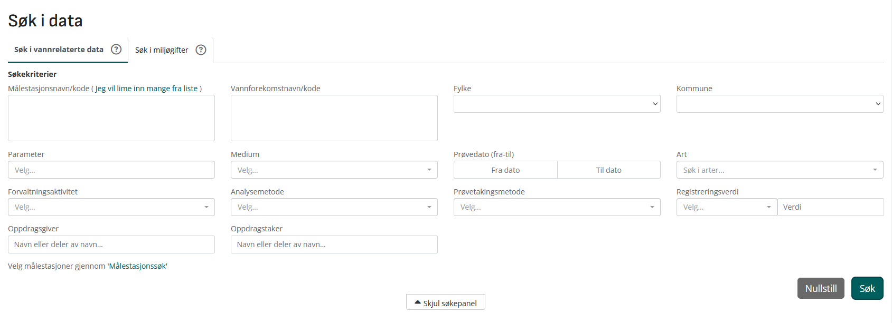
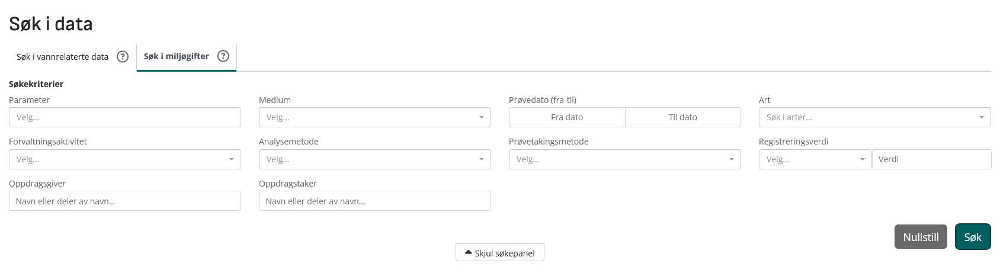

- Vm offer two ways to get data: a frontend at https://vannmiljo.miljodirektoratet.no/ (including a qGIS-powered map interface), and an API (documented [here](https://vannmiljokoder.miljodirektoratet.no/api), needs a key)

- In practical terms Vannmiljø consists of two primary tables: `WaterLocation` (site data) and `WaterRegistration` (parameter data), linked by the key `WaterLocation.Vannlokalitet ID` = `WaterRegistration.Vannlokalitet_kode`

  - this is a many-to-one relationship - a single site can have many samples, a single sample can only have one site

# Frontend

Vannmiljø's frontend is good but not great. It offers a decent range of differentiation in querying, plus the ability to trace individual datapoints and view them on a map is very useful. However, the UI is restrictive in places.

## [Søk i data](https://vannmiljo.miljodirektoratet.no/#/searchregistrations) - Search in data

This is how you search `WaterRegistration`. The UI has two panes: "vannrelaterte data", a supercategory that covers all measured indices (including measured chemical concentrations but also biological, physicochemical and hydrological parameters), and `miljøgifter`, which includes only chemical data (although note that *vannrelaterte* is perhaps misnamed, as data on chemical concentrations in non-aquatic media can also be downloaded here).

Based on my testing, both of these panes return data in the same format. However, for no apparent reason (perhaps just a mistake) the miljøgifter panel doesn't allow querying by any geographical parameters (Målestasjonsnavn/kode, Vannforekomstnavn/kode, Fylke, Kommune).

